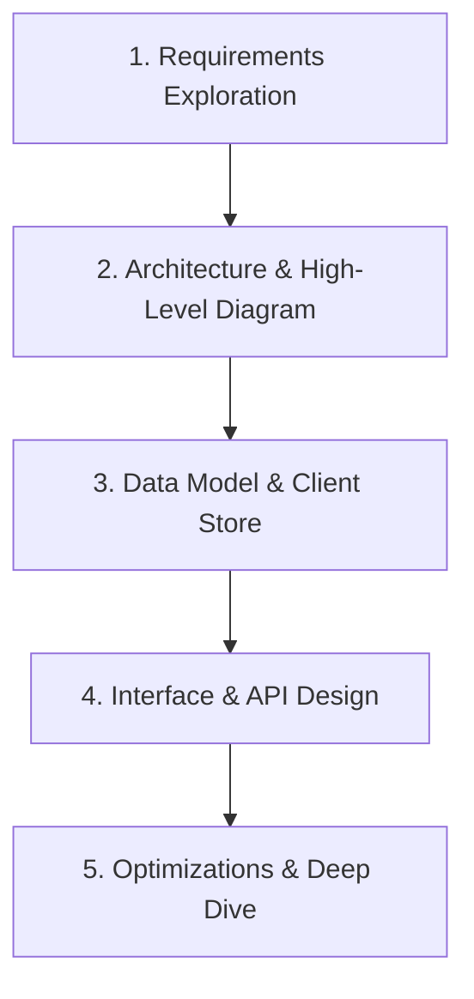
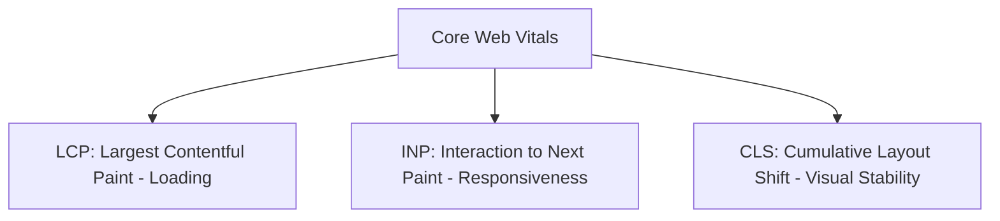
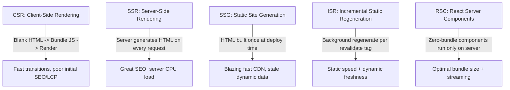
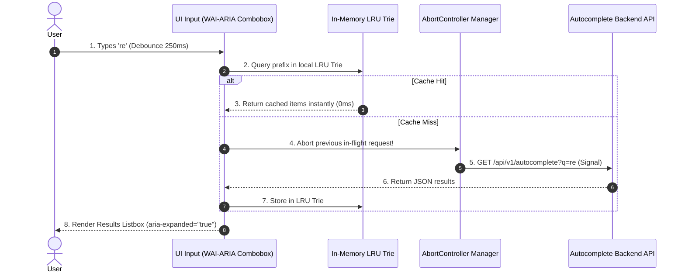
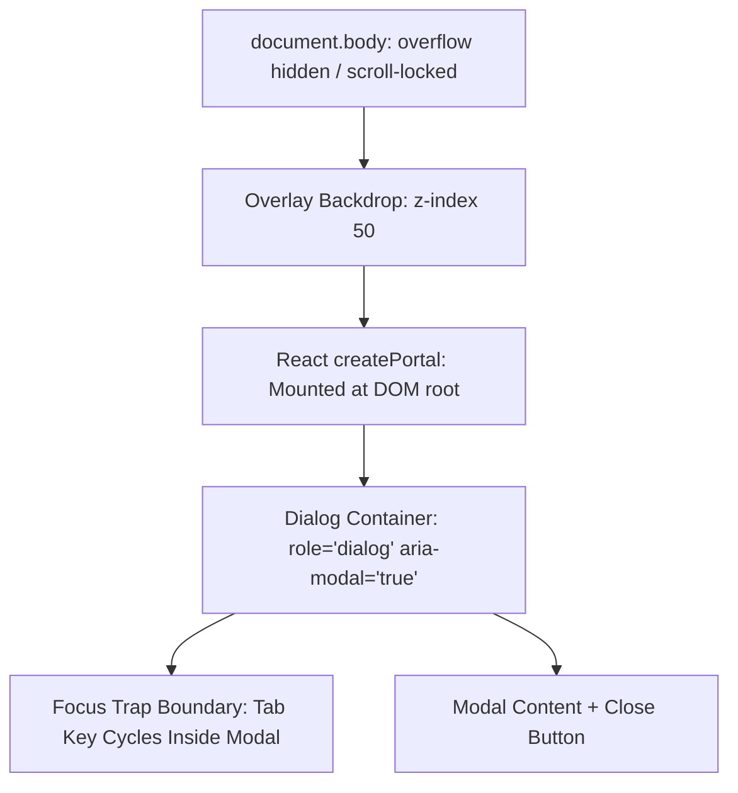

# Frontend System Design - Foundations, RADIO Framework & Core Components

Welcome to the Frontend System Design Foundations Guide. This codex covers systematic frameworks, Core Web Vitals optimization, rendering patterns, and production-grade UI component architectures required for Senior Frontend and Full-Stack System Design interviews.

---

## Theory Questions & Answers

### Q1: What is the RADIO Framework for Frontend System Design Interviews?

**Answer:**
The **RADIO Framework** (developed by GreatFrontEnd and staff frontend engineers) provides a structured, time-tested approach to navigate open-ended frontend architecture interviews in 45 minutes.



#### Step-by-Step Breakdown:

1.  **Requirements Exploration (5–7 mins):**
    *   *Functional Requirements:* What core features are in scope? (e.g., text search, dropdown suggestions, keyboard navigation, selection handlers).
    *   *Non-Functional Requirements:* Target devices (Mobile vs. Desktop), browser support, latency SLAs (e.g., $<100\text{ms}$ response), accessibility (WCAG AA), internationalization (i18n).
2.  **Architecture & High-Level Component Hierarchy (10–12 mins):**
    *   Decompose the UI into modular, reusable components with clear boundaries.
    *   Define data flow: Server $\to$ API Client $\to$ Cache / Global Store $\to$ UI Components $\to$ DOM.
3.  **Data Model & State Architecture (7–10 mins):**
    *   Design normalized client state: `entities` (keyed by ID) + `uiState` (loading, active selection index, open/closed modal flags).
    *   Choose state layer: Server State (TanStack Query, SWR) vs. Client State (Zustand, Redux) vs. Local Component State (`useState`).
4.  **Interface / API Specification (5–7 mins):**
    *   Define network contracts (REST endpoints, query parameters, payload schemas).
    *   Specify pagination contracts: Cursor-based vs. Offset-based.
5.  **Optimizations & Edge Cases (10 mins):**
    *   Performance: Virtualization, request debouncing, aborting obsolete requests, in-memory caching, Core Web Vitals.
    *   Accessibility: Full keyboard navigation (WAI-ARIA 1.2 standards), screen reader announcements.

---

### Q2: What are Core Web Vitals (LCP, INP, CLS) and how do you optimize them?

**Answer:**
Google's **Core Web Vitals** measure real-world user experience and directly impact search rankings.



| Metric | Target | What It Measures | Optimization Strategies |
| :--- | :--- | :--- | :--- |
| **LCP** (Largest Contentful Paint) | **$\le 2.5\text{s}$** | Time until the largest image or text block is visible in the viewport | • Add `<link rel="preload" as="image" href="..." fetchpriority="high">`<br>• Use modern formats (AVIF / WebP)<br>• Inline critical CSS; defer non-critical JS<br>• Edge CDN caching & HTTP/3 |
| **INP** (Interaction to Next Paint) | **$\le 200\text{ms}$** | Responsiveness to user input (clicks, keypresses, taps) | • Break long JavaScript tasks using `scheduler.yield()` or `requestIdleCallback`<br>• Use React `useTransition` / Concurrent Mode<br>• Offload heavy computation to Web Workers<br>• Debounce/throttle expensive handlers |
| **CLS** (Cumulative Layout Shift) | **$\le 0.1$** | Unexpected visual shifting of page elements during loading | • Set explicit `width` and `height` (or `aspect-ratio`) on all images and video tags<br>• Reserve placeholder space for dynamic ads/widgets<br>• Use `font-display: optional` or preload web fonts to prevent FOIT/FOUT layout shifts |

---

### Q3: Contrast Frontend Rendering Patterns: CSR, SSR, SSG, ISR, Islands, and React Server Components (RSC).

**Answer:**



| Pattern | Render Location | Render Time | TTFB | FCP / LCP | SEO | Client JS Bundle |
| :--- | :--- | :--- | :--- | :--- | :--- | :--- |
| **CSR** (SPA) | Client Browser | On page load | Fastest (empty HTML) | Slowest | Weak | Heavy |
| **SSR** | Node.js Server | Per request | Moderate | Fast | Excellent | Moderate (needs Hydration) |
| **SSG** | Build Server | Build time | Fastest (Edge CDN) | Fastest | Excellent | Moderate |
| **ISR** | Edge Server | On demand / Stale | Fastest | Fastest | Excellent | Moderate |
| **Islands** (Astro) | Server + Client | Static + Islands | Fastest | Fastest | Excellent | Tiny (only interactive islands hydrated) |
| **RSC** (Next.js) | Server (Streams JSON/HTML) | Per request / cached | Fast | Fastest | Excellent | Zero JS for server-only components |

---

### Q4: Design an Autocomplete / Typeahead Component (Comprehensive RADIO Breakdown)

**Answer:**
Design an accessible, production-grade autocomplete and typeahead search component delivering instant suggestions with optimal network efficiency and zero race conditions.



#### 1. Requirements Exploration
*   **Functional Requirements:**
    *   User enters a search term; after typing at least 2 characters, display a dropdown list of matching suggestions.
    *   Clicking or pressing Enter on a suggestion selects the item (filling input or triggering navigation).
    *   Highlight matched substrings in bold within each suggestion label.
    *   Full keyboard accessibility: ArrowDown/ArrowUp moves selection, Enter selects, Escape closes.
    *   Clear button to reset query and dropdown.
    *   Loading spinner and empty state ("No results found").
*   **Non-Functional Requirements:**
    *   *Latency:* $<100\text{ms}$ perceived response time.
    *   *Network Efficiency:* Debounce keystrokes ($250\text{ms}$) and cache results locally in RAM.
    *   *Race Condition Prevention:* In-flight network requests from earlier keystrokes must not overwrite newer results.
    *   *Accessibility:* Adhere strictly to **WAI-ARIA 1.2 Combobox** specifications.

#### 2. Component Architecture & Hierarchy
```
<AutocompleteContainer>
  ├── <ComboboxInput> (text input, clear button, loading indicator)
  ├── <ResultsListbox> (dropdown popup, overflow scroll)
  │     ├── <ResultOption> (item label, highlighted bold match, icon)
  │     └── <EmptyState / ErrorState>
  ├── <CacheService> (In-memory LRU Trie store)
  └── <NetworkManager> (AbortController & Debounce handler)
```

#### 3. Data Model & Component State
```ts
interface AutocompleteState {
  query: string;
  results: SuggestionItem[];
  isOpen: boolean;
  selectedIndex: number; // -1 when no option is focused
  status: 'idle' | 'loading' | 'success' | 'error';
  errorMessage: string | null;
}

interface SuggestionItem {
  id: string;
  label: string;
  category?: string;
  metadata?: Record<string, any>;
}
```

#### 4. Interface & API Design
*   **API Contract:** `GET /api/v1/autocomplete?q={encodeURIComponent(query)}&limit=10`
*   **Props Interface:**
    ```tsx
    interface AutocompleteProps {
      placeholder?: string;
      minQueryLength?: number; // default: 2
      debounceMs?: number;     // default: 250
      fetchSuggestions: (query: string, signal: AbortSignal) => Promise<SuggestionItem[]>;
      onSelect: (item: SuggestionItem) => void;
      renderItem?: (item: SuggestionItem, isSelected: boolean) => React.ReactNode;
    }
    ```

#### 5. Optimizations & Edge Cases
1.  **Request Cancellation with `AbortController`:**
    ```ts
    let abortController = new AbortController();

    async function handleSearch(query: string) {
      abortController.abort(); // Cancel previous pending network request
      abortController = new AbortController();

      try {
        const data = await fetchSuggestions(query, abortController.signal);
        setResults(data);
      } catch (err: any) {
        if (err.name !== 'AbortError') setError(err);
      }
    }
    ```
2.  **In-Memory LRU Trie Cache:**
    *   Store past queries in an LRU Trie cache so repeated backspaces or common prefixes ("re", "rea", "react") resolve in $0\text{ms}$ with zero network calls.
3.  **WAI-ARIA 1.2 Combobox Accessibility:**
    *   Input: `role="combobox"`, `aria-autocomplete="list"`, `aria-expanded={isOpen}`, `aria-controls="autocomplete-results"`, `aria-activedescendant={selectedIndex >= 0 ? "option-" + selectedIndex : undefined}`.
    *   Dropdown: `id="autocomplete-results"`, `role="listbox"`.
    *   Option: `id={"option-" + index}`, `role="option"`, `aria-selected={index === selectedIndex}`.
4.  **Keyword Match Highlighting:**
    *   Split the suggestion text using a case-insensitive regular expression: `text.split(new RegExp('(' + query + ')', 'gi'))` and wrap matched segments in `<b>` tags.

---

### Q5: Design an Accessible, Performant Image Carousel / Slider Component

**Answer:**

```mermaid
graph TD
    LeftBtn[< Prev Button] --> Viewport[Carousel Viewport: overflow-hidden]
    Viewport --> Track[Sliding Track: CSS transform translateX]
    Track --> Slide1[Slide 1: Active]
    Track --> Slide2[Slide 2]
    Track --> Slide3[Slide 3]
    Viewport <-- RightBtn[Next > Button]
```

#### Architecture Requirements:
1.  **CSS Hardware Acceleration:**
    *   Use `transform: translate3d(-Xpx, 0, 0)` and `will-change: transform` to trigger GPU composition rather than modifying `left` / `margin-left` (which triggers expensive browser reflows).
2.  **Touch & Swipe Physics:**
    *   Listen to `pointerdown`, `pointermove`, `pointerup`.
    *   Calculate drag delta and apply a friction multiplier ($0.3\times$) when swiping past boundaries.
3.  **Virtual Slide Window (Memory Preservation):**
    *   For carousels with 100+ images, render only the active slide, 1 previous slide, and 1 next slide ($3$ total DOM nodes). Replace off-screen slides with blank placeholder spacers.
4.  **Accessibility & Reduced Motion:**
    *   Respect `@media (prefers-reduced-motion: reduce)` by disabling smooth transition animations.
    *   Announce slide changes to screen readers using an `aria-live="polite"` status region.

---

### Q6: Design a Bulletproof Modal / Dialog Component in React

**Answer:**



#### Critical Implementation Challenges:
1.  **DOM Portal (`ReactDOM.createPortal`):**
    *   Renders the modal markup as a direct child of `document.body` to escape parent CSS stacking contexts (`z-index`, `overflow: hidden`, `transform`).
2.  **Body Scroll Locking:**
    *   When the modal opens, set `document.body.style.overflow = "hidden"`.
    *   Compensate for disappearing scrollbar by adding padding equal to `window.innerWidth - document.documentElement.clientWidth`.
3.  **Focus Trap & Return Focus:**
    *   Traps keyboard `Tab` and `Shift+Tab` inside the modal's focusable elements (`button`, `input`, `a[href]`).
    *   When the modal closes, focus returns to the trigger element that opened it.
4.  **Escape Key & Backdrop Click:** Closes on `keydown` `Escape` or clicking the outer backdrop.

---

### Q7: Design System Architecture: Compound Components and Polymorphic Props

**Answer:**

*   **Compound Component Pattern:**
    *   Allows components to share implicit state and communicate without prop-drilling (e.g., `<Select>`, `<Select.Option>`, `<Tabs>`, `<Tabs.List>`, `<Tabs.Panel>`).
    *   Implemented via React Context:
        ```tsx
        const TabsContext = createContext<{ activeTab: string; setActiveTab: (id: string) => void } | null>(null);

        export function Tabs({ defaultTab, children }: TabsProps) {
          const [activeTab, setActiveTab] = useState(defaultTab);
          return <TabsContext.Provider value={{ activeTab, setActiveTab }}>{children}</TabsContext.Provider>;
        }
        ```
*   **Polymorphic `as` Prop:**
    *   Enables UI components to render as any HTML tag or custom component while retaining complete TypeScript prop safety:
        ```tsx
        type ButtonProps<E extends React.ElementType> = {
          as?: E;
          children: React.ReactNode;
        } & React.ComponentPropsWithoutRef<E>;

        export function Button<E extends React.ElementType = "button">({ as, ...props }: ButtonProps<E>) {
          const Component = as || "button";
          return <Component {...props} />;
        }
        ```

---

*More frontend system design case studies and architectural breakdowns will be added soon.*
