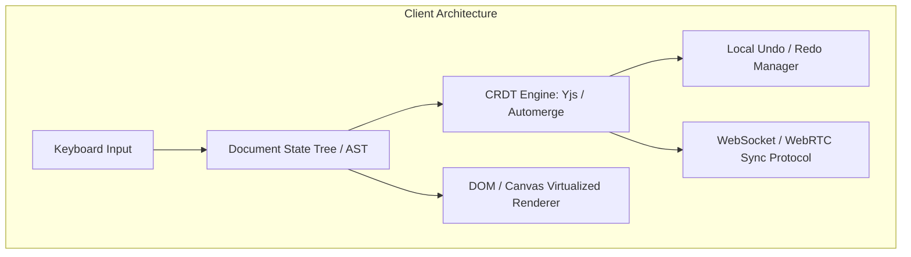
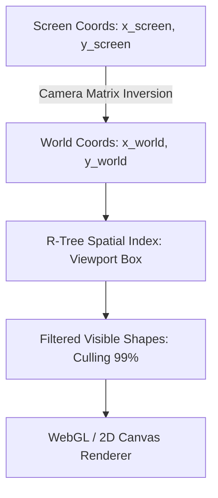
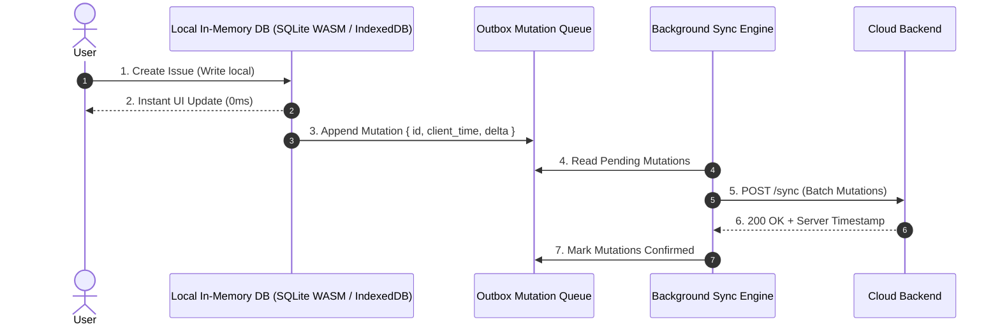
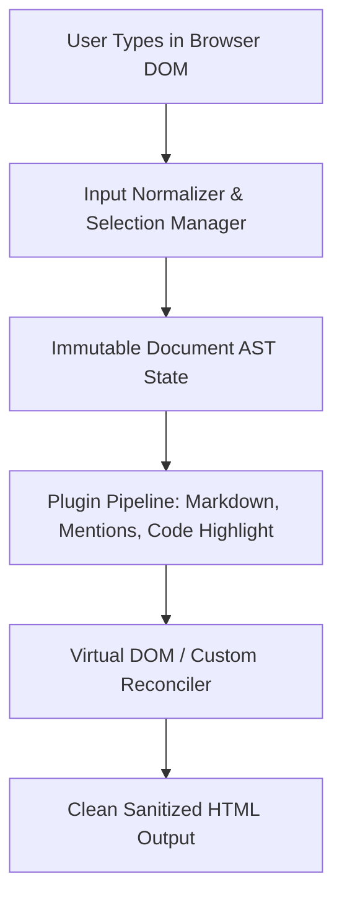
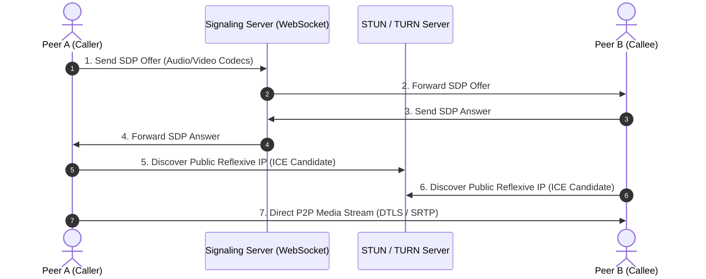

# Frontend System Design - Deep Tech & Planetary Client Engines

Welcome to the Frontend System Design Master Guide. This codex explores the hardest client-side engineering problems: Collaborative Document Editors (CRDTs), Infinite Pan/Zoom Canvases, Offline-First Sync Engines, Server-Driven UI (SDUI), Rich Text AST Engines, WebRTC Video Calling, and In-Browser WebAssembly Transcoders.

---

## Theory Questions & Answers

### Q1: Design a Real-Time Collaborative Document Editor (Google Docs / Figma / Notion)

**Answer:**
Building a collaborative editor requires concurrent multi-user editing, deterministic conflict resolution, local undo/redo stacks, and cursor presence.



#### Core Architectural Decisions:

1.  **Conflict-Free Replicated Data Types (CRDTs) vs. OT:**
    *   *OT (Operational Transformation):* Requires a single centralized server to order all operations (Jupiter model).
    *   *CRDTs (State-of-the-Art - Yjs, Automerge):* Peer-to-peer capable. Each character or node has a globally unique fractional ID (e.g., Lamport timestamp + Client ID). Any two clients can merge their states in any order and are mathematically guaranteed to converge to the exact same document without server intervention.
2.  **Local vs. Remote Undo/Redo Stacks:**
    *   Pressing `Ctrl+Z` must only undo **your own past edits**, never your teammate's simultaneous edits.
    *   The Undo Manager tracks an inverse delta stack tagged with `clientId === localUserId`.
3.  **Rendering Engine (DOM ContentEditable vs. Custom Canvas):**
    *   *ContentEditable (Notion, Medium):* Fast to build, but browser inconsistencies in selection ranges and HTML cleanup make large documents buggy.
    *   *Custom Canvas / WebGL (Google Docs, Figma):* Bypasses the DOM completely. Renders glyphs directly onto an HTML5 Canvas, achieving $60\text{ FPS}$ smooth scrolling on 500-page documents.

---

### Q2: Design an Infinite Pan & Zoom Canvas / Whiteboard (Figma / Excalidraw / Canva)

**Answer:**
An infinite whiteboard must support millions of vector shapes, smooth $60\text{ FPS}$ panning/zooming, multi-pointer touch gestures, and spatial rendering.



#### Mathematical & Spatial Pillars:

1.  **Camera Coordinate Transformation Matrix:**
    *   Convert between Screen Pixels and World Coordinates:
        *   `x_world = (x_screen - panX) / zoom`
        *   `y_world = (y_screen - panY) / zoom`
2.  **Spatial Indexing (R-Tree / QuadTree Viewport Culling):**
    *   Iterating through 50,000 shapes on every frame drops FPS to $5$.
    *   Store all shape bounding boxes in an in-memory **R-Tree** (e.g., `rbush`).
    *   On each render tick (`requestAnimationFrame`), query the R-Tree with the current visible screen bounding box:
        ```ts
        const visibleElements = tree.search(viewportBoundingBox);
        ```
    *   Only render the elements returned ($\sim 20\text{ to }50$ shapes), achieving silky smooth $60\text{ FPS}$.
3.  **Multiplayer Cursor Interpolation:**
    *   Remote user mouse positions are broadcast via WebSockets at 20Hz.
    *   The client uses **Hermite / Bezier interpolation** to animate remote cursors smoothly at 60Hz.

---

### Q3: Design an Offline-First Reactive Client Sync Engine (Linear / Trello)

**Answer:**
Applications like **Linear** achieve zero-latency interactions by performing all reads and writes against an in-memory / local SQLite database first, synchronizing changes to the server asynchronously.



#### Key Architecture Principles:
1.  **Local Read/Write Autonomy:**
    *   Every user action executes synchronously against local IndexedDB / SQLite WASM. The UI updates with $0\text{ms}$ latency.
2.  **The Outbox Pattern & Persistent Mutation Queue:**
    *   Mutations are placed in a persistent Outbox queue. If the user goes offline (Airplane Mode) for 5 hours, mutations accumulate locally. When internet reconnects, the sync engine drains the outbox in chronological order.
3.  **Conflict Resolution via Client Lamport Clocks & LWW:**
    *   Each mutation is tagged with a logical Lamport timestamp: `timestamp = Math.max(localClock, serverClock) + 1`.
    *   Conflicts on record fields are resolved using **Last-Write-Wins (LWW)** or column-level CRDT merging.

---

### Q4: Design a Server-Driven UI (SDUI) Framework (Airbnb / Faire / Lyft)

**Answer:**
**Server-Driven UI (SDUI)** allows backend services to control the layout, components, and user flows of web and mobile clients dynamically without requiring client app updates or app store deployments.

```mermaid
graph TD
    Client[Web / Mobile App] -->|GET /api/v1/page/home| Server[SDUI Layout Engine]
    Server --> JSON[Component Schema Tree JSON]
    JSON --> Renderer[Client SDUI Dynamic Component Registry]
    Renderer --> Banner[<HeroBanner data={...} />]
    Renderer --> Carousel[<ProductCarousel data={...} />]
    Renderer --> Grid[<TwoColumnGrid data={...} />]
```

#### JSON Schema Structure:
```json
{
  "type": "screen",
  "id": "checkout_screen_v2",
  "sections": [
    {
      "type": "BANNER",
      "props": { "title": "50% Off Flash Sale", "variant": "warning" }
    },
    {
      "type": "CAROUSEL",
      "props": {
        "items": [{ "id": 1, "name": "Item A" }],
        "onSelect": { "action": "NAVIGATE", "route": "/product/1" }
      }
    }
  ]
}
```

#### Client Renderer Implementation:
1.  **Component Registry:**
    *   A map binding schema `type` strings to native React components:
        ```tsx
        const COMPONENT_MAP: Record<string, React.ComponentType<any>> = {
          BANNER: HeroBanner,
          CAROUSEL: ProductCarousel,
          GRID: TwoColumnGrid
        };
        ```
2.  **Fallback Degradation:**
    *   If the server sends a newly introduced component type that an older client build doesn't recognize, the client silently ignores it or renders a generic fallback container without crashing.

---

### Q5: Design a Rich Text Editing Engine (Lexical / Slate / Tiptap AST)

**Answer:**



#### Internal Architecture:
1.  **Immutable Abstract Syntax Tree (AST):**
    *   Document content is stored as an immutable tree of Nodes (`RootNode` $\to$ `ParagraphNode` $\to$ `TextNode` with format bitmasks for Bold, Italic, Code).
2.  **Selection State Normalization:**
    *   Browser native `window.getSelection()` is notoriously inconsistent across Chrome, Safari, and Firefox.
    *   The engine maintains an internal `RangeSelection` containing `{ anchor: { key, offset }, focus: { key, offset } }` mapped to AST node keys rather than fragile DOM nodes.
3.  **Extensible Node Plugin Architecture:**
    *   Features like `@mentions`, tables, markdown shortcuts, and code syntax highlighting are isolated as transform plugins that intercept AST mutations before they hit the DOM.

---

### Q6: Design a WebRTC Peer-to-Peer Video Call & Screen Sharing Client (Zoom / Google Meet Web)

**Answer:**
Building a browser-based real-time video conferencing application requires signaling, peer discovery, ICE negotiation, adaptive video resolution, and screen capture streaming.



#### Key Architecture Decisions:
1.  **Mesh vs. SFU (Selective Forwarding Unit):**
    *   *P2P Mesh:* Viable only for 2–3 participants ($N \times (N-1)$ network streams saturate upstream bandwidth).
    *   *SFU Architecture (Mediasoup / LiveKit):* Clients send 1 upstream stream to an SFU server; the SFU forwards audio/video packets to other participants without transcoding, scaling up to 100+ callers.
2.  **Screen Sharing via `getDisplayMedia()`:**
    *   Captures desktop display stream and swaps the video track dynamically on the active `RTCPeerConnection` using `sender.replaceTrack(screenTrack)`.

---

### Q7: Design an In-Browser Video Transcoder & Audio Engine with WebAssembly & WebCodecs

**Answer:**
Modern rich web applications (e.g., Canva, Descript, Kapwing) execute heavy media processing on the client machine to eliminate expensive cloud GPU transcoding bills.

*   **Architecture Pipeline:**
    1.  *Web Worker Isolation:* Offload FFmpeg compiled to WebAssembly (C/C++ $\to$ Emscripten) onto background Web Workers with `SharedArrayBuffer` memory sharing to keep the main UI thread at $60\text{ FPS}$.
    2.  *Hardware Acceleration via WebCodecs API:* Access GPU-accelerated video decoders (`VideoDecoder`) and encoders (`VideoEncoder`) directly from JavaScript to extract raw `VideoFrame` planes.
    3.  *OffscreenCanvas Rendering:* Render video effects, captions, and transitions on an `OffscreenCanvas` rendered in a Worker thread.

---

### Q8: Design an Enterprise Design System Token Pipeline (Multi-Brand & Dark Mode)

**Answer:**
Scaling UI components across multiple brands (e.g., Uber Rider vs. Uber Driver vs. Uber Eats) requires an automated, single-source-of-truth token architecture.

```mermaid
graph TD
    Figma[Figma Variables / Design Tokens JSON] --> StyleDict[Style Dictionary Build Tool]
    StyleDict --> CSSVars[CSS Custom Properties: :root, [data-theme='dark']]
    StyleDict --> TS[TypeScript Design Token Enums & Types]
    StyleDict --> Tailwind[Tailwind CSS Theme Preset]
```

*   **3-Tier Token Hierarchy:**
    1.  *Global (Primitive) Tokens:* Raw color hex values (`blue-500: #3b82f6`).
    2.  *Semantic Tokens:* Purpose-driven abstraction (`bg-surface-primary`, `text-interactive-hover`).
    3.  *Component Tokens:* Scoped overrides (`btn-primary-background: var(--color-brand-accent)`).

---

*More frontend system design case studies and architectural breakdowns will be added soon.*
