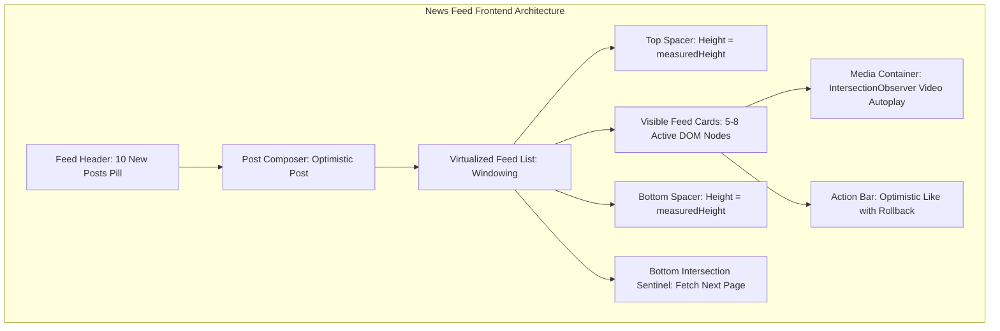

# Frontend System Design - Complex Systems & Production Architectures

Welcome to the Frontend System Design Advanced Guide. This codex deconstructs large-scale frontend applications: Virtualized News Feeds, Real-Time Messaging Clients, E-Commerce Checkouts, Travel Booking, Ride-Hailing Clients, and Video Streaming Players.

---

## Theory Questions & Answers

### Q1: Design a News Feed (Facebook / Twitter / Instagram - Comprehensive RADIO Breakdown)

**Answer:**
Design the frontend architecture for a high-performance, infinite scrolling social News Feed displaying rich media posts (text, images, video), post creation, real-time engagement reactions, and smooth $60\text{ FPS}$ scrolling.



#### 1. Requirements Exploration
*   **Functional Requirements:**
    *   Display a continuous feed of chronological/ranked posts containing author details, timestamp, markdown text, images, and videos.
    *   Infinite scroll: automatically fetch the next page of posts as the user scrolls near the bottom.
    *   Post composer: create a new post with instant optimistic feed insertion.
    *   Engagement: like / react to a post with immediate local UI count update.
    *   Real-time banner: notify the user when new posts are available ("10 new posts $\uparrow$") without abruptly jumping the scroll position.
*   **Non-Functional Requirements:**
    *   *Smooth Performance:* Maintain a solid $60\text{ FPS}$ during scrolling on mid-tier mobile devices; keep DOM node count bounded ($<30$ nodes) via **List Virtualization**.
    *   *Fast Initial Load:* First Contentful Paint (FCP) $<1.5\text{s}$, Largest Contentful Paint (LCP) $<2.5\text{s}$.
    *   *Offline & Network Resilience:* Cache recent feed posts in IndexedDB for immediate offline rendering; optimistic mutations with automatic retry and rollback.
    *   *Resource Optimization:* Auto-play videos only when $\ge 50\%$ visible in viewport using `IntersectionObserver`; pause immediately when scrolled away.

#### 2. Component Architecture & Hierarchy
```
<FeedContainer>
  ├── <NewPostsFloatingBanner> ("10 New Posts" - Scrolls to top on click)
  ├── <PostComposer> (Rich text draft, image uploader, optimistic dispatch)
  ├── <VirtualizedFeedList>
  │     ├── <TopPhantomSpacer style={{ height: topPadding }} />
  │     ├── <FeedCard key={postId}>
  │     │     ├── <PostHeader> (Avatar, author name, timestamp, menu)
  │     │     ├── <PostContent> (Expandable text with "See more")
  │     │     ├── <PostMediaGallery> (Responsive grid / video player)
  │     │     └── <PostActionBar> (Like button, Comment count, Share)
  │     ├── <BottomPhantomSpacer style={{ height: bottomPadding }} />
  │     └── <InfiniteScrollSentinel /> (Observed by IntersectionObserver)
  └── <FeedLoadingSkeleton />
```

#### 3. Data Model & Normalized Client Store
Maintain a normalized state store (Zustand / Redux) to prevent duplicate data across components:
```ts
interface NormalizedFeedState {
  entities: {
    posts: Record<string, PostEntity>;
    users: Record<string, UserEntity>;
    comments: Record<string, CommentEntity>;
  };
  feed: {
    postIds: string[];
    cursor: string | null;
    hasMore: boolean;
    isFetchingNextPage: boolean;
    newPostCount: number;
  };
}

interface PostEntity {
  id: string;
  authorId: string;
  createdAt: string;
  content: string;
  media: Array<{ type: 'image' | 'video'; url: string; aspectRatio: number }>;
  likeCount: number;
  isLikedByMe: boolean;
  commentCount: number;
}
```

#### 4. Interface & API Design
*   `GET /api/v1/feed?cursor={cursor}&limit=10` $\to$ Returns `{ posts: PostEntity[], nextCursor: string | null, hasMore: boolean }`
*   `POST /api/v1/posts` $\to$ Payload `{ content: string, mediaIds: string[] }`
*   `POST /api/v1/posts/{id}/like` $\to$ Toggles like state with idempotency.

#### 5. Optimizations & Deep Dive
1.  **List Virtualization (Dynamic Height Caching):**
    *   Maintain an estimated height per post card. Measure actual rendered heights asynchronously using a shared `ResizeObserver` and store in an in-memory prefix-sum array to compute exact top/bottom padding offsets in $O(\log N)$ time.
2.  **IntersectionObserver for Video Autoplay & Viewport Lazy Loading:**
    ```ts
    const observer = new IntersectionObserver(
      (entries) => {
        entries.forEach((entry) => {
          const video = entry.target as HTMLVideoElement;
          if (entry.isIntersecting && entry.intersectionRatio >= 0.5) {
            video.play().catch(() => {});
          } else {
            video.pause();
          }
        });
      },
      { threshold: 0.5 }
    );
    ```
3.  **Optimistic UI Updates with Rollback:**
    *   When the user clicks "Like", immediately set `isLikedByMe = true` and increment `likeCount += 1`.
    *   Dispatch the API call in the background. If the request fails after 3 retries, revert the count and show a toast notification.
4.  **Preserving Scroll Position on New Posts:**
    *   When new posts arrive via WebSockets, do **not** prepend them immediately to the top of the active list (which would cause a jarring layout shift for the user reading a post). Instead, increment `newPostCount` in a floating pill button ("10 new posts $\uparrow$") and prepend only when clicked.

---

### Q2: Design a Travel Booking & Interactive Map Platform (Airbnb / Expedia)

**Answer:**
Design a search and booking platform coordinating responsive filter bars, date-range calendar pickers, virtualized property listings, and interactive map pin clustering.

*   **Architecture Reference:** [Rearchitecting Airbnb's Frontend (Medium Engineering)](https://medium.com/airbnb-engineering/rearchitecting-airbnbs-frontend-5e213efc24d2)
*   **Key Design Pillars:**
    1.  *Bidirectional URL Synchronization:* All filters (price range, amenities, date bounds, map coordinates `ne_lat`, `sw_lng`) are serialized directly into URL query parameters for shareability and browser back-button support.
    2.  *Spatial Map Pin Clustering (Supercluster):* Aggregate thousands of property markers into cluster bubbles using a spatial QuadTree running in a Web Worker.
    3.  *Virtualized Date-Range Calendar:* Render multi-month availability grids using CSS Grid windowing to eliminate off-screen DOM overhead.

---

### Q3: Design a Ride-Hailing Web Client & Driver Dispatch Frontend (Uber Web)

**Answer:**
Design a lightweight, responsive web ride-booking application supporting real-time GPS vehicle tracking, pickup point selection, route polyline animation, and surge pricing alerts.

*   **Architecture Reference (Video):** [Uber Frontend System Design Walkthrough](https://www.youtube.com/watch?v=ijAoqaNYO0c)
*   **Key Design Pillars:**
    1.  *Driver Location Interpolation:* Smooth driver car marker movement on WebGL / Mapbox maps using Hermite spline interpolation between 4-second GPS WebSocket ticks.
    2.  *Polyline Decoding:* Decode Google Maps encoded route polylines on the client and render via Canvas/WebGL layers.
    3.  *Pickup Geocoding with Debounce:* Autocomplete pickup addresses with session tokens to minimize third-party API billing.

---

### Q4: Design a Progressive Web App for Low-Bandwidth & Emerging Markets (Ola PWA)

**Answer:**
Design an ultra-lightweight Progressive Web App (PWA) operating under unstable 2G/3G network connections with minimal data consumption and near-instant load times.

*   **Case Study Reference:** [Ola PWA Case Study (Google web.dev)](https://web.dev/case-studies/ola)
*   **Key Design Pillars:**
    1.  *Tiny Initial Bundle Size ($<200\text{KB}$):* Code splitting with dynamic `import()`, lightweight UI primitives, and zero heavy external libraries.
    2.  *Service Worker Cache-First Strategy:* Cache app shell HTML, CSS, and icons via Service Workers (`workbox-precaching`) to ensure instant $0\text{ms}$ cold starts.
    3.  *Offline Request Outbox:* Queue ride booking requests in IndexedDB when offline, automatically dispatching when the browser detects `navigator.onLine === true`.

---

### Q5: Design a Video & Media Streaming Player (YouTube / Netflix)

**Answer:**
Design a custom HTML5 video player supporting Media Source Extensions (MSE), adaptive bitrate streaming (HLS / DASH), buffer starvation management, and interactive scrubber previews.

*   **Architecture Reference:** [HTML5 Video at Netflix (Netflix Tech Blog)](https://netflixtechblog.com/html5-video-at-netflix-721d1f143979)
*   **Key Design Pillars:**
    1.  *Media Source Extensions (MSE):* Fetch binary `.m4s` video/audio chunks over HTTP and append directly into the browser's `SourceBuffer`.
    2.  *Adaptive Bitrate Algorithm (ABR):* Monitor network throughput and dropped frame rates; switch dynamically between 1080p, 720p, and 480p chunk streams seamlessly.
    3.  *Thumbnail Scrubbing Preview:* Load image sprite sheets; on progress bar hover, calculate timestamp position and adjust `background-position` on a tooltip lens.

---

### Q6: Design a Real-Time Live Chat & Messaging Frontend (Slack / WhatsApp Web)

**Answer:**
Design a multi-channel messaging client supporting instant delivery, offline IndexedDB persistence, typing indicators, and optimistic message queues.

*   **Key Design Pillars:**
    1.  *WebSocket Lifecycle & Heartbeat:* Maintain a singleton WebSocket connection with 30s ping/pong heartbeats and exponential backoff jitter on reconnection.
    2.  *Offline-First Local DB:* Mirror conversations in browser IndexedDB; initial render loads from IndexedDB in $0\text{ms}$ while syncing delta timestamps asynchronously.
    3.  *Optimistic Outbox Queue:* Assign temporary UUIDs to outgoing messages, render with a pending indicator, and transition to "delivered" upon server ACK.

---

*More frontend system design case studies and architectural breakdowns will be added soon.*
