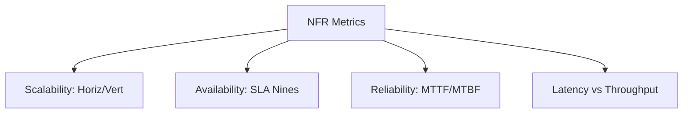
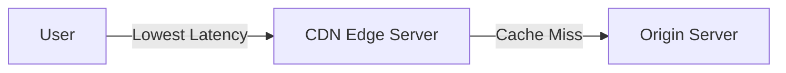
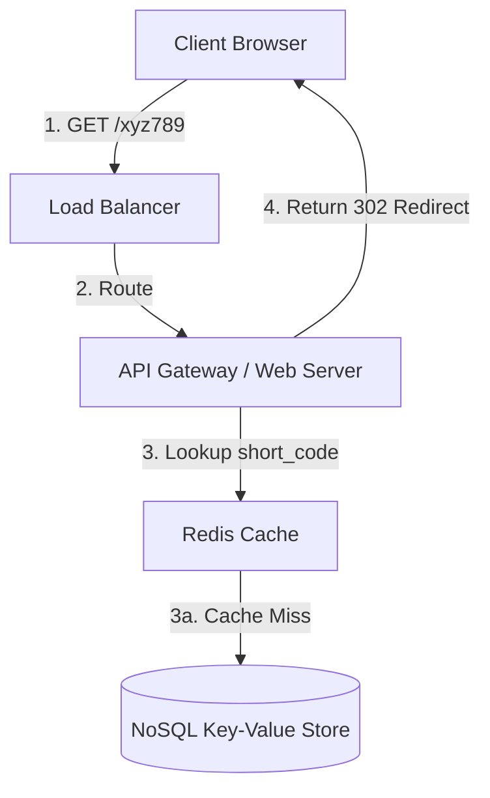
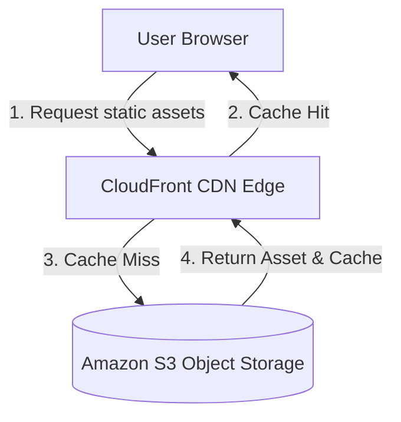
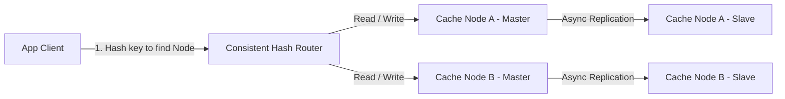
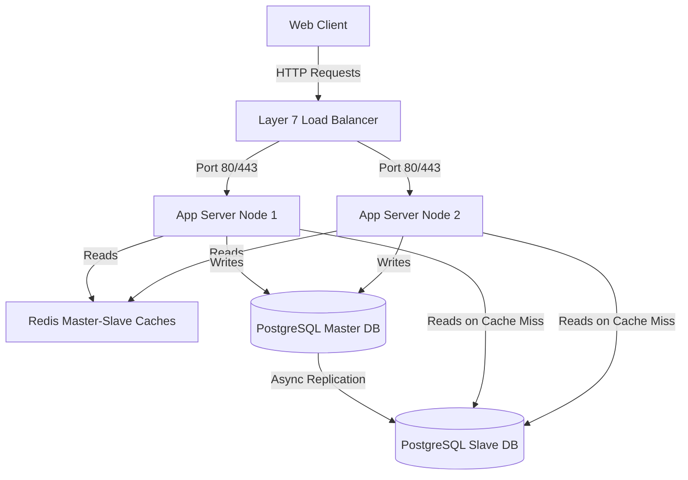
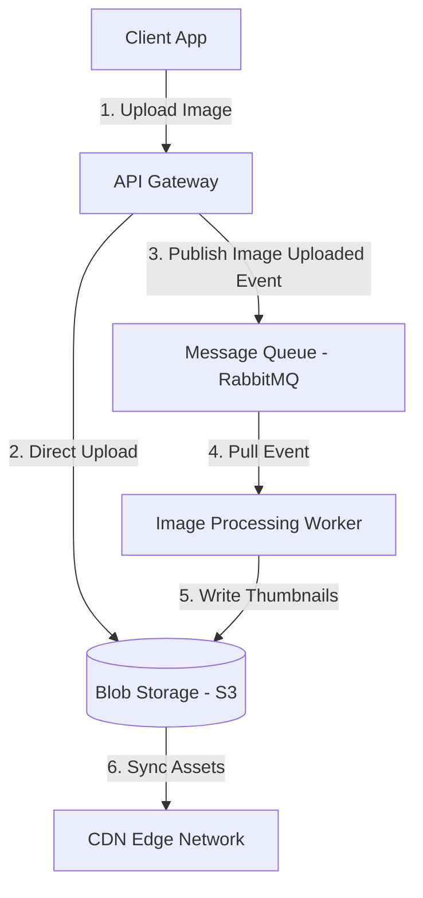
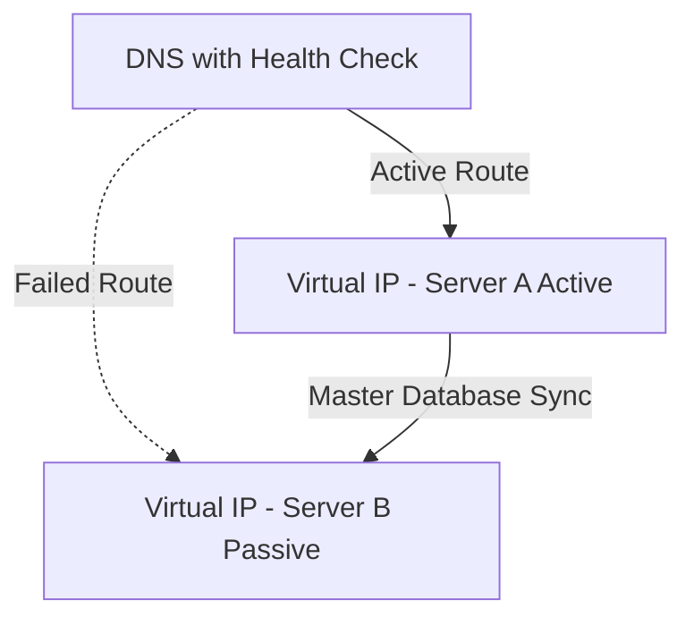
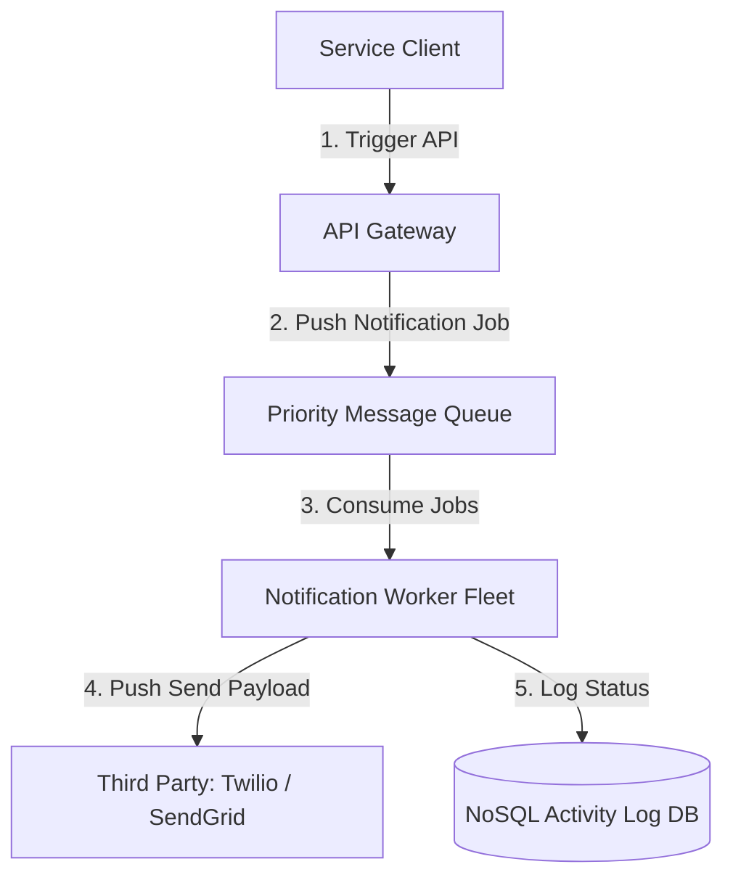

# HLD - Basic Interview Questions

Welcome to the High-Level Design (HLD) Basic Prep Guide. This document covers foundational elements of system scalability, load balancing, caching, networking, databases, replication, and basic architecture challenges.

---

## Theory Questions & Answers

### Q1: Define Scalability, Availability, Reliability, and Latency vs. Throughput.

**Answer:**
These represent the core non-functional metrics (NFRs) used to evaluate distributed system health and capacity.

*   **Scalability:** The system's ability to handle growing volume of traffic/work by adding computing resources.
    *   *Vertical (Scale Up):* Adding more power (CPU, RAM, SSD) to a single machine. bounded by hardware ceilings and acts as a Single Point of Failure (SPOF).
    *   *Horizontal (Scale Out):* Adding more machines to the resource pool. Requires a Load Balancer (LB) and distributed coordination, but supports infinite growth.
*   **Availability:** The percentage of time a system remains fully functional and accessible.
    *   *SLA (Service Level Agreement):* Measured in "nines". 99.9% ("three nines") allows ~8.76 hours of downtime/year; 99.999% ("five nines") allows only ~5.26 minutes/year.
    *   *Active-Passive:* One active server handles traffic; passive standby replicates state and takes over via failover on active node failure.
    *   *Active-Active:* All nodes handle traffic concurrently, maximizing resource utility.
*   **Reliability:** The probability that a system performs its function without failure over time. While availability is "is it up?", reliability is "does it perform correctly without error when used?". Measured via **MTBF** (Mean Time Between Failures) and **MTTF** (Mean Time To Failure).
*   **Latency vs. Throughput:**
    *   *Latency:* Time taken for a single request to travel from sender to receiver and back (measured in ms).
    *   *Throughput:* Number of requests or data units processed per unit of time (e.g., Transactions Per Second - TPS, or Queries per Second - QPS).

---

### Q2: Explain Load Balancing. Contrast Layer 4 and Layer 7 Load Balancing, and list core routing algorithms.

**Answer:**
A **Load Balancer (LB)** routes client requests across a pool of servers to optimize resource utilization, maximize throughput, and prevent server bottlenecks.

*   **Layer 4 (L4) Load Balancing:**
    *   Operates at the transport layer (TCP/UDP).
    *   Routes traffic based on IP address and port numbers.
    *   Does not inspect request content (cannot read HTTP headers, cookies, or payloads).
    *   *Pros:* Extremely fast, low CPU usage, highly secure (no SSL/TLS termination needed).
*   **Layer 7 (L7) Load Balancing:**
    *   Operates at the application layer (HTTP/HTTPS/FTP).
    *   Routes traffic based on headers, cookies, URL paths, and query parameters.
    *   Requires terminating and decrypting SSL/TLS traffic.
    *   *Pros:* Intelligent routing (e.g., `/images` to CDN, `/api` to microservice), allows cookie-based sticky sessions.
*   **Core Routing Algorithms:**
    *   *Round Robin:* Cycles through servers sequentially. Assumes uniform server capacity.
    *   *Weighted Round Robin:* Assigns traffic proportionally based on server capability weights.
    *   *Least Connections:* Directs traffic to the server with the fewest active connections. Best for long-lived sessions.
    *   *IP Hash:* Hashes client IP to assign a dedicated server. Guarantees session persistence (sticky sessions).

---

### Q3: Explain Caching Strategies, eviction policies, and cache-consistency patterns.

**Answer:**
A **Cache** is a high-speed, temporary, in-memory data store (e.g., Redis, Memcached) used to shield databases and serve data fast.

*   **Cache-Consistency Write Strategies:**
    *   *Cache-Aside (Lazy Loading):* Read checks cache first. On miss, reads from DB, writes back to cache, and returns. Writes go directly to DB, then invalidates cache key.
    *   *Write-Through:* Writes update cache and DB *synchronously* in a single transaction. Guarantees consistency but increases write latency.
    *   *Write-Back (Write-Behind):* Writes update cache immediately; async background worker batch-updates DB. High write performance, but risks data loss on cache crash.
*   **Eviction Policies:**
    *   *LRU (Least Recently Used):* Evicts keys unaccessed for the longest duration.
    *   *LFU (Least Frequently Used):* Evicts keys with the lowest access count.
    *   *FIFO (First-In, First-Out):* Evicts keys in order of creation.
*   **Cache Failures:**
    *   *Cache Penetration:* Client requests keys existing in neither cache nor DB. *Mitigation:* Cache null values with low TTL, or use **Bloom Filters**.
    *   *Cache Avalanche:* Multiple keys expire simultaneously or cache crashes, flooding DB. *Mitigation:* Add random TTL jitter, use highly available cache clusters.
    *   *Cache Stampede:* A highly popular key expires and concurrent requests miss cache, hitting DB to recalculate simultaneously. *Mitigation:* Implement distributed locks or background pre-warming.

---

### Q4: What is a CDN (Content Delivery Network)? Contrast Push vs. Pull CDNs.

**Answer:**
A **CDN** is a globally distributed network of edge servers designed to cache static and dynamic assets close to users, reducing physical network latency.

*   **Pull CDN:**
    *   Edge servers fetch content from the origin server on the first cache miss.
    *   *Use case:* High-traffic sites with standard static assets (images, CSS, JS). Low maintenance.
*   **Push CDN:**
    *   Origin server explicitly uploads/pushes content to CDN storage.
    *   *Use case:* Large, rarely updated files (software downloads, video files). Content is guaranteed to be on the CDN before the first request.

---

### Q5: Contrast SQL vs. NoSQL databases. When would you use one over the other?

**Answer:**
*   **SQL (Relational):**
    *   Structured schema with strict tables, columns, and foreign keys.
    *   Supports **ACID** (Atomicity, Consistency, Isolation, Durability) guarantees.
    *   Scales vertically (horizontal scaling via sharding is complex).
    *   *Use Case:* Financial systems, order management, user profiles requiring transactional safety.
*   **NoSQL (Non-Relational):**
    *   Flexible schema (Document, Key-Value, Column-family, Graph).
    *   Prioritizes **BASE** (Basically Available, Soft-state, Eventual consistency).
    *   Scales horizontally by default.
    *   *Use Case:* Real-time analytics, catalog systems, high-volume sensor data, unstructured logs.

---

### Q6: What is DNS (Domain Name System)? Explain its resolution steps.

**Answer:**
**DNS** translates human-readable domain names (e.g., `google.com`) into machine-routable IP addresses.

*   **Resolution Steps (Client to IP):**
    1.  **Local Cache Check:** OS/Browser checks local cache.
    2.  **Recursive Resolver:** Hits ISP or public recursive DNS resolver (e.g., `8.8.8.8`).
    3.  **Root Nameserver:** Resolver queries root (`.`) for TLD server.
    4.  **TLD Nameserver:** Resolver queries TLD (`.com`) for authoritative nameserver.
    5.  **Authoritative Nameserver:** Resolver fetches exact IP.
    6.  **Caching:** Resolver caches IP and returns it to Client.

---

### Q7: What is Horizontal vs. Vertical Scaling? Discuss cost and single point of failure (SPOF).

**Answer:**
*   **Vertical Scaling:**
    *   *Cost:* Exponentially expensive as hardware limits are reached.
    *   *SPOF:* High risk. If the single machine crashes, the entire system goes down.
    *   *Downtime:* Often requires hardware restarts to add CPU/RAM.
*   **Horizontal Scaling:**
    *   *Cost:* Linear and predictable. Runs on cheap, commodity hardware.
    *   *SPOF:* Resilient. If one node fails, load balancer routes traffic to surviving nodes.
    *   *Complexity:* High. Demands distributed data consistency and networking overhead.

---

### Q8: Explain the difference between Synchronous and Asynchronous communication.

**Answer:**
*   **Synchronous:**
    *   Caller blocks, waiting for the receiver to process the request and return a response.
    *   *Protocol:* HTTP, gRPC.
    *   *Risk:* Cascading failures and thread pool starvation if downstream services slow down.
*   **Asynchronous:**
    *   Caller fires request and immediately resumes work. Notification of completion happens via callback, event, or queue polling.
    *   *Protocol:* AMQP, Kafka, MQTT.
    *   *Benefit:* Decouples services, absorbs load spikes, improves system responsiveness.

---

### Q9: What are WebSockets vs. HTTP Long Polling vs. Server-Sent Events (SSE)?

**Answer:**
*   **HTTP Long Polling:** Client requests data; server holds connection open until new data is available or timeout occurs. Client immediately opens another request. *High overhead*.
*   **WebSockets:** Full-duplex, bidirectional communication over a single TCP connection. *Ideal for real-time multiplayer, chat, gaming*.
*   **SSE (Server-Sent Events):** Monodirectional client-to-server connection where server stream-pushes text updates. Runs over standard HTTP. *Ideal for stock tickers, live news feeds*.

---

### Q10: What is a Single Point of Failure (SPOF) and how do you eliminate it?

**Answer:**
A **SPOF** is any part of a system whose failure stops the entire system from working.

*   **Elimination Strategy:** Redundancy + Automated Failover.
    *   *Web Servers:* Run multiple stateless nodes behind a Load Balancer.
    *   *Database:* Maintain Master-Slave replication with automatic promotion via consensus/monitoring.
    *   *Network:* Use redundant internet service providers and switches.

---

### Q11: Explain RAID (Redundant Array of Independent Disks) at a high level.

**Answer:**
**RAID** combines multiple physical hard drives into a single logical unit to protect against disk failures and/or increase speed.

*   **RAID 0 (Striping):** Splits data across disks. High performance, zero redundancy (any disk failure = data loss).
*   **RAID 1 (Mirroring):** Duplicates data on multiple disks. High redundancy, higher cost (halves total capacity).
*   **RAID 5 (Striping + Parity):** Distributes data and parity across $\ge 3$ disks. Survives single disk failure with decent capacity.
*   **RAID 10 (1+0):** Mirrors and stripes. Extreme speed and resilience, but requires double the disk count.

---

### Q12: What is High Availability (HA)? How do active-passive and active-active setups work?

**Answer:**
**HA** ensures system services remain operational over long durations with minimal downtime.

*   **Active-Passive Setup:**
    *   Active node handles all live traffic.
    *   Passive node acts as standby, heartbeat-monitoring the active node.
    *   On active failure, virtual IP switches to passive (failover).
*   **Active-Active Setup:**
    *   All nodes simultaneously handle traffic.
    *   Distributes load across the cluster.
    *   Requires active-active database replication or stateless nodes to avoid split-brain consistency bugs.

---

### Q13: What is Replication? Contrast Master-Slave and Master-Master Replication.

**Answer:**
**Replication** copies data across multiple servers to increase read throughput, enhance availability, and prevent data loss.

*   **Master-Slave (Primary-Replica):**
    *   Writes go exclusively to the Master. Master streams log updates to Slaves.
    *   Reads are distributed across all Slaves (scales reads).
    *   *Trade-off:* Slave promotion is required if Master dies; potential read lag.
*   **Master-Master (Multi-Primary):**
    *   Writes can go to any Master node. Masters sync writes bi-directionally.
    *   *Trade-off:* High risk of write conflicts; requires complex resolution (Vector Clocks or Last-Write-Wins).

---

### Q14: Explain Database Indexing. How do B-Trees/B+Trees speed up read queries?

**Answer:**
An **Index** is a data structure designed to accelerate data retrieval operations at the cost of slower writes and extra storage.

*   **B+Tree Internals:**
    *   Organized as a self-balancing, multi-way search tree.
    *   *Internal Nodes:* Store search keys and child pointers only (increases fan-out).
    *   *Leaf Nodes:* Store actual data/pointers in a sorted, doubly-linked list.
    *   *Why B+Tree?* Supports both fast point lookups ($O(\log N)$) and efficient range scans (via traversal of the leaf linked list).

---

### Q15: What are the key HTTP status codes used in high-level system APIs?

**Answer:**
*   **200 OK / 201 Created:** Successful query / creation.
*   **301 Moved Permanently:** Permanent redirection (CDNs, SEO).
*   **302 Found:** Temporary redirect (session routing, short URLs).
*   **400 Bad Request:** Client syntax error.
*   **401 Unauthorized / 403 Forbidden:** No credentials / lacks permissions.
*   **404 Not Found:** Resource missing.
*   **429 Too Many Requests:** Throttled/Rate limited.
*   **500 Internal Server Error:** General crash on server.
*   **503 Service Unavailable / 504 Gateway Timeout:** Downstream overload or network timeout.

---

### Q16: What is the difference between monolithic and microservice architectures?

**Answer:**
*   **Monolith:**
    *   Single, unified codebase deploying all modules together.
    *   *Pros:* Simple testing, local function calls (low latency), ease of deployment initially.
    *   *Cons:* Scaling a single bottleneck requires scaling the whole stack; code release dependencies.
*   **Microservices:**
    *   Decoupled, fine-grained services collaborating via network APIs (HTTP, gRPC).
    *   *Pros:* Independent deployments, technology-agnostic, isolated horizontal scaling.
    *   *Cons:* High network latency, distributed transaction complexity (Sagas), operations overhead.

---

### Q17: What is rate limiting and why is it important in distributed systems?

**Answer:**
**Rate Limiting** throttles incoming requests to protect service infrastructure from exhaustion.

*   **Why it matters:**
    *   Prevents **Denial of Service (DoS)** attacks and API abuse.
    *   Ensures fair use among API clients.
    *   Protects backend resources (DB, third-party APIs) from thundering herd spikes.

---

### Q18: Explain IP, TCP, and UDP protocols and their relevance to HLD.

**Answer:**
*   **IP (Internet Protocol):** Directs and routes individual packets across network borders based on IP addresses. Lacks delivery guarantees.
*   **TCP (Transmission Control Protocol):** Connection-oriented protocol. Guarantees ordered, reliable delivery of bytes via sequence numbers and ACKs. Features flow and congestion control. *Used for HTTP, APIs, databases*.
*   **UDP (User Datagram Protocol):** Connectionless, lightweight protocol. Sends packets immediately without handshakes or delivery checks. *Used for real-time media streaming, DNS, gaming*.

---

### Q19: What is session persistence (Sticky Sessions) and what are its pros and cons?

**Answer:**
**Sticky Sessions** route all subsequent requests from a specific client to the exact same backend server instance.

*   **Pros:** Easy to implement; allows caching session data locally in the application server's RAM.
*   **Cons:** Uneven load distribution (if one server gets sticky, popular users); server failures cause session loss unless persisted externally.

---

### Q20: Explain what a Heartbeat or Ping is in distributed systems.

**Answer:**
A **Heartbeat** is a periodic signal sent between nodes to declare status and detect node failures.

*   **Mechanism:** Node A sends a ping packet to Node B every $T$ seconds.
*   **Timeout:** If Node B fails to receive Node A's heartbeat within $(k \times T)$ seconds, Node B marks Node A as offline and initiates cluster failover or master re-election.

---

### Q21: What is an API Gateway? What are its primary functions?

**Answer:**
An **API Gateway** is a single entry point for all client requests, routing them to appropriate backend microservices.

*   **Core Functions:**
    *   *Routing:* Dynamic reverse-proxying.
    *   *Security:* SSL/TLS termination, authentication, authorization.
    *   *Resilience:* Rate limiting, circuit breaking, request logging.

---

### Q22: Explain the concept of Database Normalization vs. Denormalization.

**Answer:**
*   **Normalization:**
    *   Splitting data into multiple related tables to eliminate redundancy.
    *   *Pros:* Minimizes storage, simplifies data updates, maintains integrity.
    *   *Cons:* Requires heavy `JOIN` operations, degrading read performance at scale.
*   **Denormalization:**
    *   Redundantly storing duplicate data within tables to optimize reads.
    *   *Pros:* Blazing fast reads with fewer or zero `JOIN`s.
    *   *Cons:* Increases storage footprints; updates require multi-table modifications (potential inconsistency).

---

### Q23: What is a reverse proxy? How does it differ from a forward proxy?

**Answer:**
*   **Forward Proxy:** Sits in front of **clients**. Hides client identity; routes requests from private networks to public internet (e.g., corporate web filter).
*   **Reverse Proxy:** Sits in front of **servers**. Hides server identity; receives client requests and distributes them internally (e.g., Nginx, Apache).

---

### Q24: Explain SSL/TLS Termination and why we do it at the Load Balancer level.

**Answer:**
**SSL/TLS Termination** is the decryption of encrypted traffic at an entry point before routing it inside the internal network.

*   **Why do it at the LB?**
    *   Decryption is CPU-intensive. Offloading it from app servers frees resources for business logic.
    *   Simplifies certificate management (certificates updated in one place on LB).

---

### Q25: What is data redundancy, and how do checksums ensure data integrity?

**Answer:**
*   **Data Redundancy:** Storing duplicate copies of data across geographically isolated drives or nodes to survive physical data destruction.
*   **Checksums:** Mathematical functions (e.g., MD5, SHA-256) that map files/packets to a unique string. Comparing checksums before and after transfer/storage detects silent data corruption.

---

### Q26: What is the role of a message broker (e.g., RabbitMQ, Kafka) at a basic level?

**Answer:**
A **Message Broker** facilitates asynchronous, decoupled communication between system modules.

*   **Producer:** Sends message to broker.
*   **Broker:** Enqueues or streams the message.
*   **Consumer:** Polls or receives message asynchronously.
*   **Benefit:** Buffers spikes in user requests, ensuring downstream databases are not overwhelmed.

---

### Q27: Define Latency. What are some of the main sources of network and disk latency?

**Answer:**
*   **Sources of Latency:**
    *   *Network:* Propagation delay (speed of light in fiber optic cables), queueing delay at routers, TCP handshakes.
    *   *Disk:* HDD seek times (mechanical arm movement $\approx 10\text{ ms}$), SSD flash reads ($\approx 0.1\text{ ms}$), cache RAM reads ($\approx 10\text{ ns}$).
    *   *Mitigation:* Keep state in RAM (Redis), place resources physically close to users (CDNs).

---

### Q28: What is connection pooling in database client libraries?

**Answer:**
**Connection Pooling** maintains a cache of active, open database connections.

*   **Why use it:** Establishing a TCP and TLS connection to a database is expensive. Re-using existing connections from a pre-allocated pool reduces connection latency from $\sim 100\text{ ms}$ to $< 1\text{ ms}$.

---

### Q29: What is database backup? Contrast hot (active) backups vs. cold backups.

**Answer:**
*   **Hot Backup:** Executed while the database is actively running and taking writes. *Pros:* Zero downtime. *Cons:* Complex; requires transactional logging/snapshots to guarantee state consistency.
*   **Cold Backup:** Executed while the database is completely offline and shut down. *Pros:* Extremely simple and 100% consistent. *Cons:* Requires system downtime.

---

### Q30: What is an SLA, SLO, and SLI?

**Answer:**
*   **SLI (Service Level Indicator):** A quantifiable metric measuring service behavior (e.g., Latency of `/GET` user $\le 100\text{ ms}$).
*   **SLO (Service Level Objective):** Target reliability level defined by SLIs (e.g., Latency must be $\le 100\text{ ms}$ for 99.9% of requests over 30 days).
*   **SLA (Service Level Agreement):** The legal contract defining financial penalties if the SLO is not met.

---

### Q31: What is vertical scaling's hard hardware limit?

**Answer:**
Vertical scaling hits physical constraints where motherboard layouts cannot support more RAM slots, CPU cores, or PCI lanes on a single chassis. At this threshold, upgrading hardware yields zero scalability, leaving horizontal scaling as the only path.

---

### Q32: What is statelessness in application servers and why is it desirable?

**Answer:**
**Statelessness** means application servers do not store client session state (e.g., login tokens, shopping cart items) in their local memory.

*   **Why it's desirable:** Any app server can handle any request. Scaling out is as simple as adding or removing VM instances behind the load balancer with zero data sync overhead.

---

### Q33: Explain the difference between optimistic locking and pessimistic locking.

**Answer:**
*   **Pessimistic Locking:** Locks the database row immediately upon reading until the transaction finishes. *Pros:* Prevents conflicts. *Cons:* Restricts concurrency; causes deadlocks.
*   **Optimistic Locking:** Does not lock rows. Instead, it checks a `version` number on write. If the database version is higher, a collision occurred, and the transaction aborts and retries. *Pros:* High throughput in low-conflict environments.

---

### Q34: What are some common database read replication lags, and why do they occur?

**Answer:**
**Replication Lag** is the delay between a write to the Master DB and its propagation to the Slave DB.

*   **Why it occurs:** Heavy write transactions on the Master, network bottlenecks between Master and Slave nodes, or single-threaded replication engines on the Slaves.

---

### Q35: What is the purpose of database replication vs. database sharding?

**Answer:**
*   **Replication:** Copies the *entire* database to multiple servers. Designed for high availability, read scaling, and fault tolerance.
*   **Sharding:** Splits the database table horizontally, distributing *different rows* to different servers. Designed for write scaling and bypassing storage limits of single drives.

---

### Q36: What is static content caching and how does it optimize web performance?

**Answer:**
It is the caching of unchangeable web files (CSS, JS, raw images) on browsers, reverse proxies, or CDNs using HTTP `Cache-Control` headers. It completely bypasses application servers, reducing processing loads to zero for static page elements.

---

### Q37: Explain the function of a VPN (Virtual Private Network) in internal infrastructure.

**Answer:**
A **VPN** encrypts connection tunnels between external clients/offices and internal datacenter networks. It isolates database nodes and backend microservices from the public internet, restricting entry strictly to verified network endpoints.

---

### Q38: What is garbage collection (GC) in high-level languages, and how does it affect latency?

**Answer:**
**GC** automatically reclaims memory by deleting unreferenced objects.

*   **Latency Impact:** Certain GC sweeps trigger "Stop-the-World" pauses, freezing all application execution threads. This causes sudden spike anomalies (p99 latency spikes) in highly responsive APIs.

---

### Q39: What is CPU-bound vs. I/O-bound application design?

**Answer:**
*   **CPU-bound:** Processing bottlenecked by raw computing speed (e.g., cryptography, video encoding, matrix math).
*   **I/O-bound:** Processing bottlenecked by waiting on network, disk, or API calls (e.g., fetching a database row, downloading files).
    *   *Architecture:* Async non-blocking runtimes (e.g., Node.js) excel in I/O-bound, while multi-threaded runtimes excel in CPU-bound.

---

### Q40: What is a multi-tier architecture?

**Answer:**
A software architecture split into separate logical and physical layers:
1.  **Presentation Tier:** Frontend user interface (browser, mobile app).
2.  **Application Tier:** Server-side business logic (Express, Spring, Go).
3.  **Data Tier:** Datastores, queues, and persistent layers.
Separating tiers allows scaling and security-isolating each tier independently.

---

### Q41: What is a cluster, and how does node clustering provide fault tolerance?

**Answer:**
A **Cluster** is a group of interconnected servers working as a single system. If one node fails, cluster monitoring systems (e.g., Kubernetes, Consul) detect the death and automatically route traffic to surviving nodes, providing high fault tolerance.

---

### Q42: Explain what a health check is and how a load balancer uses it.

**Answer:**
A **Health Check** is a scheduled request (e.g., `GET /health`) sent by a load balancer to backend servers. If a server fails to respond with a `200 OK` multiple times, the load balancer removes the unhealthy node from the active routing pool, stopping traffic redirection to dead servers.

---

### Q43: What is a distributed unique ID, and why is standard auto-incrementing SQL ID bad for distributed systems?

**Answer:**
An auto-incrementing integer ID fails in distributed, sharded databases because independent database nodes do not communicate in real time, leading to primary key collisions (different nodes assigning the exact same ID). A distributed ID generator (e.g., Snowflake, UUIDv4) creates globally unique, non-colliding IDs without synchronous database bottlenecks.

---

## Architecture & Design Challenges

### Q44: Design a High-Scale URL Shortener (TinyURL)

**Answer:**
System capable of generating short aliases for URLs and redirecting users to original destinations.

#### 1. API Design:
*   `POST /api/v1/shorten`
    *   *Req:* `{"long_url": "https://example.com/very/long/path", "custom_alias": "promo1"}`
    *   *Res:* `{"short_url": "https://tiny.url/xyz789"}`
*   `GET /{short_code}`
    *   *Res:* `HTTP 302 Redirect` to target `long_url`.

#### 2. Schema (Cassandra/DynamoDB - High Scale Key-Value lookup):
*   **Partition Key:** `short_code` (VARCHAR, 7 characters).
*   **Attributes:** `long_url` (VARCHAR), `created_at` (TIMESTAMP), `user_id` (INT).

#### 3. Key Generation Strategy:
Use **Base62 Encoding** (`[a-z, A-Z, 0-9]`). A 7-character short URL yields $62^7 \approx 3.5\text{ Trillion}$ combinations.
*   *Range Allocation:* Maintain a central **Token Range Service** (using ZooKeeper) that distributes blocks of integers (e.g., 1000000-2000000) to each application server. Application servers convert their unique local counter to Base62, completely avoiding ID collision and network round-trips per request.

---

### Q45: Design a Static Webpage Hosting Platform (like AWS S3 + CloudFront CDN)

**Answer:**
An architecture to host static web assets (HTML, CSS, images) globally with low latency.

#### 1. Data Flow (Ingress vs. Egress):
*   *Upload (Ingress):* Developer uploads assets to **Object Store (S3)** bucket. S3 triggers an invalidation event to clear old cached assets on CDN edges.
*   *Download (Egress):* User requests `index.html`. DNS routes user to the physically closest CDN Edge server. If cached, served in $< 10\text{ ms}$. If not, fetched from S3 bucket.

#### 2. Key API Spec:
*   `GET /static/{asset_name}` -> Returns file with `Cache-Control: public, max-age=31536000` header.

---

### Q46: Design a Basic Distributed Cache Cluster

**Answer:**
A horizontally scaling, low-latency key-value cache cluster with data replication.

#### 1. Key Components:
*   **Consistent Hashing Ring:** Client routes keys to specific cache nodes based on key hashes, ensuring minimal re-hashing when cache nodes are added/removed.
*   **Master-Slave Sync:** Each cache partition has an active master and an asynchronous read slave.
*   **Failover Protocol:** If a master node drops heartbeats, the cluster coordinator (e.g., ZooKeeper/Consul) automatically promotes the slave to master.

---

### Q47: Design a Multi-Tier Contact Management System

**Answer:**
A resilient, 3-tier standard architecture for managing personal contact cards.

#### 1. API Design:
*   `POST /api/v1/contacts` -> Create contact card.
*   `GET /api/v1/contacts/{id}` -> Fetch contact details.

#### 2. Database Schema:
*   `contacts` table: `id` (UUID), `user_id` (UUID), `name` (VARCHAR), `email` (VARCHAR), `phone` (VARCHAR).

---

### Q48: Design a Scalable Image Upload & Processing System

**Answer:**
Asynchronous architecture to upload high-resolution images, generate thumbnails, and serve them globally.

#### 1. Ingestion Flow:
Client requests a presigned S3 upload URL from API Gateway. Client uploads the image directly to S3.
#### 2. Processing Flow:
S3 upload triggers an event written to a Message Queue. A fleet of auto-scaling CPU-bound worker servers pulls events, resizes images, and writes output files back to S3 under optimized formats (WebP). CDN serves final formats.

---

### Q49: Design a High-Availability Single-Server Failover Infrastructure

**Answer:**
An active-passive dual-server model with DNS-level failover monitoring for low-budget systems.

#### 1. Mechanism:
Two identical web servers run in parallel. DNS record points to Server A. A cron-health monitor checks Server A. If Server A fails three times, an API call is made to the DNS host (e.g., Route53) to switch the A-Record pointer to Server B. DB replica on Server B is promoted to master.

---

### Q50: Design a Notification Dispatcher (Email & SMS)

**Answer:**
Queue-backed notification engine capable of handling spikes and failures during mass marketing events.

#### 1. API Spec:
*   `POST /api/v1/notify`
    *   *Payload:* `{"user_id": "123", "type": "SMS", "message": "Your OTP is 9876"}`

#### 2. Key Components:
*   **Priority Queues:** Separates critical transactional notifications (OTPs) from low-priority marketing emails.
*   **Idempotency Engine:** Each notification carries a deduplication key to prevent sending duplicate SMS/Emails. Activity log DB records dispatch status.
