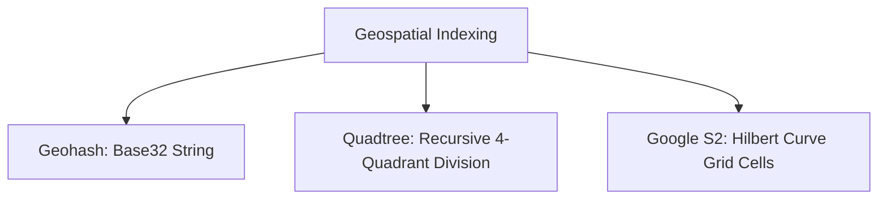
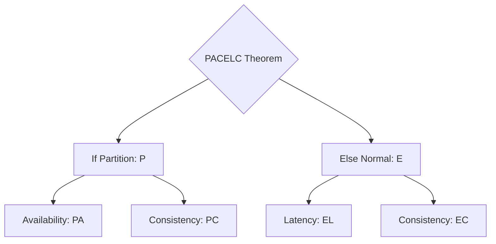
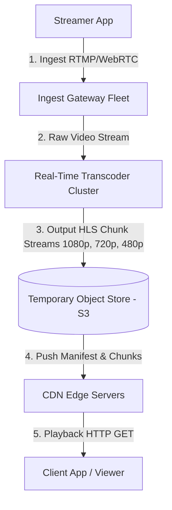
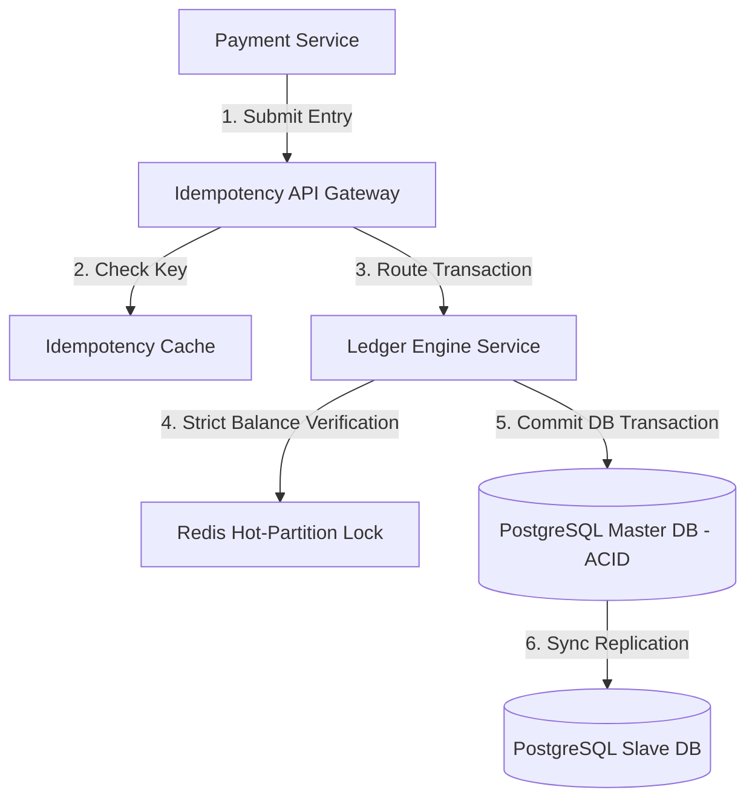
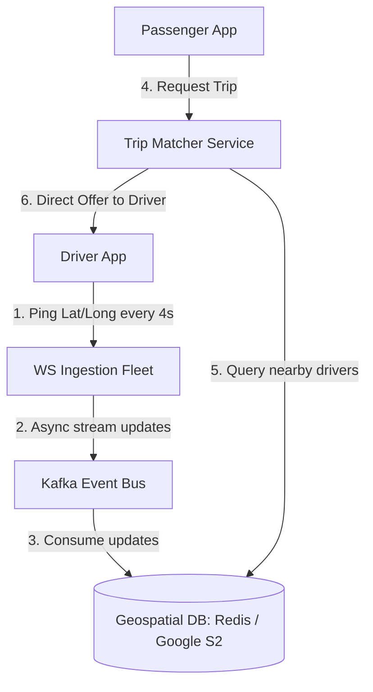
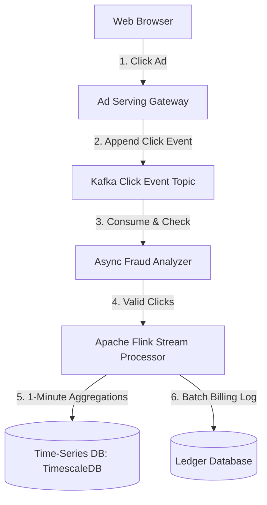
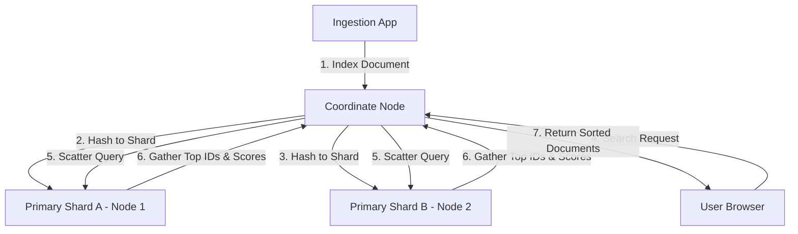
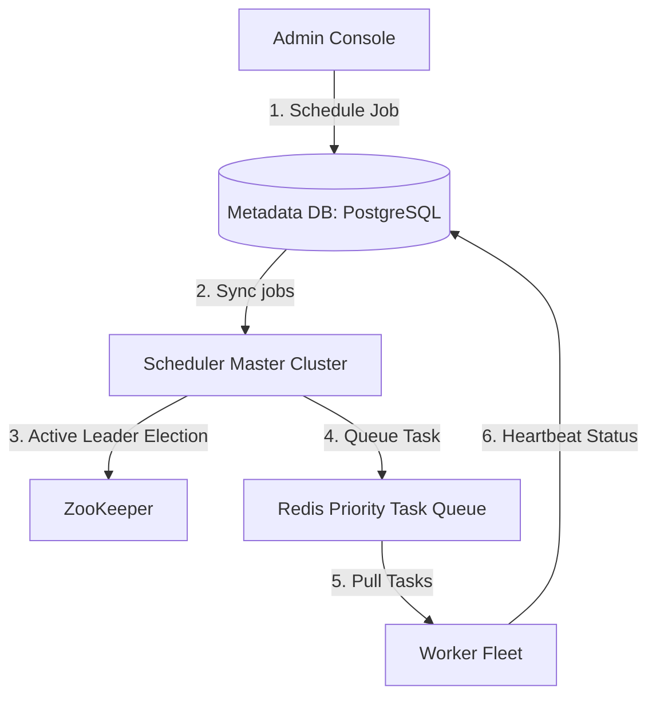
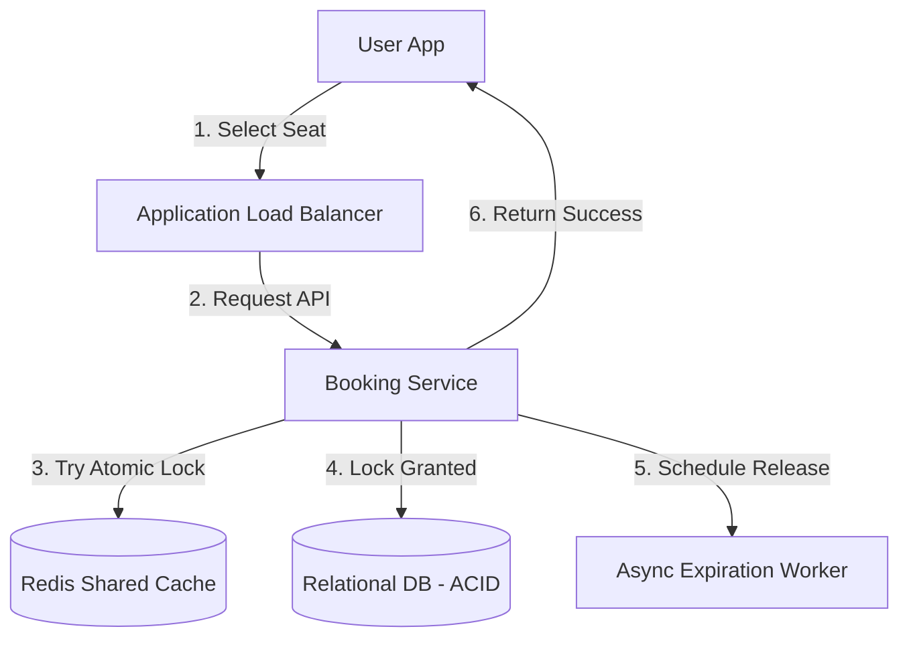

# HLD - Hard Interview Questions

Welcome to the advanced High-Level Design (HLD) Prep Guide. This document explores massive-scale distributed architectures, financial safety patterns, consensus protocols, low-level database internals, and real-time geospatial system design.

---

## Theory Questions & Answers

### Q1: Explain Geospatial Indexing. Compare Geohashes, Quadtrees, and Google S2. How does a ride-sharing system (like Uber) track and query moving drivers in real time?

**Answer:**
A ride-sharing system must track latitude/longitude updates for millions of active drivers and allow riders to search nearby regions instantly. Executing standard relational queries using `WHERE lat BETWEEN x AND y` results in full table scans ($O(N)$), crashing database processing under heavy traffic.

To solve this, we use **Geospatial Indexing** to map a 2D physical point into a 1D indexable sequence.



*   **Geohashes:**
    *   *Mechanism:* Divides the Earth into grid zones, recursively splitting them into smaller regions. Each cell is encoded as a Base32 string (e.g., `9q8yy`). Longer prefixes represent tighter boxes.
    *   *Edge/Boundary Problem:* Two points right next to each other on a grid border can have completely different Geohash prefixes (e.g., one starts with `9` and the other with `d`), making prefix queries fail to capture immediate neighbors.
*   **Quadtrees:**
    *   *Mechanism:* A tree structure where each node has exactly four children (NW, NE, SW, SE). Nodes split recursively *only* when a quadrant exceeds capacity bounds (e.g., $\ge 100$ drivers).
    *   *Pros:* Dynamically sizes cells (deep trees in New York, shallow in deserts).
    *   *Cons:* Very complex to update, balance, and synchronize in real-time memory across a distributed cluster when drivers are moving fast.
*   **Google S2:**
    *   *Mechanism:* Projects the Earth's sphere onto a cube, mapping it to a 1D index using a mathematical **Hilbert Curve**. Divides the Earth into 31 hierarchical levels of cells.
    *   *Pros:* Solves the boundary problem cleanly. Preserves spatial locality: points physically close in 2D space are highly likely to be adjacent on the 1D Hilbert index. The industry standard.

---

### Q2: Explain the PACELC Theorem. How does it expand on the CAP Theorem, and how does it apply to modern distributed databases?

**Answer:**
The **CAP Theorem** states that in the event of a network Partition ($P$), a system must choose between Consistency ($C$) and Availability ($A$).

#### Expansion to PACELC:
Partitions are rare in physical datacenters. **PACELC** models the system trade-offs during **normal operations** (when there is no partition).

$$\text{If Partition (P)} \longrightarrow \text{choose Availability (A) or Consistency (C)}$$
$$\text{Else (E)} \longrightarrow \text{choose Latency (L) or Consistency (C)}$$



*   **PA/EL System (e.g., MongoDB, DynamoDB):** During partitions, prioritizes availability. During normal operations, prioritizes low latency by writing/reading locally and updating replicas asynchronously.
*   **PC/EC System (e.g., Google Spanner, standard RDBMS):** Prioritizes consistency at all times. During normal operations, it blocks writes until synchronous replication across all nodes completes, increasing latency but preventing stale reads.

---

### Q3: Detail Paxos and Raft Consensus Protocols. How do they resolve leader election, log replication, and split-brain in fault-tolerant clusters?

**Answer:**
Consensus protocols guarantee that a cluster of nodes can agree on a sequence of state values, even if some nodes fail.

*   **Raft (Leader-Based Protocol):**
    *   *States:* Follower, Candidate, Leader.
    *   *Leader Election:* If a follower stops receiving heartbeats (Election Timeout), it transitions to Candidate, increments the *Term*, votes for itself, and requests votes from peers. It becomes Leader if it receives a majority of votes ($\ge N/2 + 1$).
    *   *Log Replication:* All writes go to the Leader. The Leader writes sequentially to its log and sends an `AppendEntries` RPC to followers. Once a majority of followers ACK the write, the Leader *commits* it and applies it to its local state machine.
    *   *Split-Brain Prevention:* The majority requirement ensures only one candidate can secure enough votes to become Leader in any partition. If a partition heals, the leader with the lower *Term* is demoted to follower.
*   **Paxos (Leaderless/Multi-Leader):**
    *   Operates in two phases:
        1.  *Phase 1 (Prepare):* Proposer sends a proposal number $N$ to acceptor nodes. Acceptors return their highest accepted value if they promise not to accept any future proposals numbered $< N$.
        2.  *Phase 2 (Accept):* If a majority of acceptors agree, the proposer broadcasts the value to acceptors to finalize the write.

---

### Q4: Explain Vector Clocks vs. Lamport Timestamps. How do they track causality and detect/resolve conflicts?

**Answer:**
Standard physical clocks cannot be used to order events in distributed systems due to network latencies and inevitable clock drift.

*   **Lamport Timestamps:**
    *   Every node maintains a local integer counter, initialized to 0.
    *   Before executing a local event, increment the counter: $L = L + 1$.
    *   When sending a message, attach the local counter value.
    *   When receiving a message, update local counter: $L_{\text{recv}} = \max(L_{\text{local}}, L_{\text{msg}}) + 1$.
    *   *Limitation:* If $L(A) < L(B)$, we **cannot** conclude that event A caused event B; it only provides a total ordering, not causal history.
*   **Vector Clocks:**
    *   Every node maintains an array/vector of size $N$ (where $N$ is the cluster size).
    *   When sending a message, Node $i$ increments its own element: $V_i[i] = V_i[i] + 1$ and attaches the vector.
    *   When receiving a message from Node $j$, update local vector: $V_i[k] = \max(V_i[k], V_{\text{msg}}[k])$ for all $k$, and increment $V_i[i] = V_i[i] + 1$.
    *   *Causality:* Event $A$ causally preceded $B$ if every element in $V(A) \le V(B)$ and at least one element is strictly smaller. If elements diverge (e.g., $V(A)$ has some higher values and $V(B)$ has others), a **conflict** is detected, requiring application-level resolution.

---

### Q5: What are CRDTs (Conflict-free Replicated Data Types)? Explain state-based vs. operation-based types.

**Answer:**
**CRDTs** are distributed data structures that can be updated independently and concurrently across replicas without coordination, guaranteeing eventual convergence without conflict resolution loops.

*   **State-Based (CvRDT):**
    *   Replicas sync by sending their entire local state to other replicas.
    *   A merge function must be **commutative** ($A \sqcup B = B \sqcup A$), **associative** ($A \sqcup (B \sqcup C) = (A \sqcup B) \sqcup C$), and **idempotent** ($A \sqcup A = A$).
    *   *Use Case:* PNCounter (Positive-Negative Counter), LWW-Element-Set (Last-Write-Wins Set).
*   **Operation-Based (CmRDT):**
    *   Replicas sync by broadcasting individual operation payloads (e.g., "Add 5", "Remove Item X").
    *   Requires a reliable, causal, ordered network delivery channel to guarantee all replicas apply operations in compatible sequences.
    *   *Use Case:* Collaborative real-time document editors (e.g., Figma, Google Docs).

---

### Q6: Detail LSM-Trees vs. B+ Trees. Explain write amplification, read amplification, and compaction.

**Answer:**
*   **B+ Trees:**
    *   *Operation:* Updates data in-place by writing to random pages on disk.
    *   *Read Amplification:* Low. Point lookup reads a single branch path down to leaf ($O(\log N)$).
    *   *Write Amplification:* High. A minor update to a single byte requires rewriting the entire 4KB-16KB database page to disk.
*   **LSM-Trees (Log-Structured Merge-Trees):**
    *   *Operation:* All writes append sequentially to an in-memory **MemTable** and a disk WAL. When the MemTable is full, it is flushed to disk as a sorted, immutable **SSTable** file.
    *   *Compaction:* Background threads merge and deduplicate multiple sorted SSTable levels (Size-Tiered or Leveled Compaction), purging older key versions to free space.
    *   *Write Amplification:* Medium. Writing sequentially is extremely fast, but compaction continuously rewrites data during merges.
    *   *Read Amplification:* High. To find a key, the engine must scan the MemTable and potentially multiple SSTable files on disk. Bloom Filters are used to skip SSTables that do not contain the target key.

---

### Q7: Explain Single-Leader, Multi-Leader, and Leaderless Replication. Discuss conflict resolution.

**Answer:**
*   **Single-Leader:** All writes go to one node; reads scale via replica slaves.
    *   *Pros:* Simple consistency management.
    *   *Cons:* Leader is a write bottleneck and single point of failure (SPOF).
*   **Multi-Leader:** Multiple master nodes accept writes (often distributed across distinct geographic datacenters).
    *   *Conflict Resolution:* Requires complex reconciliation engines using **Vector Clocks** or **Last-Write-Wins (LWW)** (which relies on physical clock synchronization, risking data loss).
*   **Leaderless (Dynamo-Style):** Writes are broadcast directly to $N$ replicas.
    *   *Quorum Read/Write:* Writes are successful if acknowledged by $W$ nodes; reads query $R$ nodes. If $R + W > N$, the overlap guarantees that at least one read replica contains the latest written version.
    *   *Read Repair:* When a read query detects version differences among replicas, the client engine writes the latest version back to stale nodes.

---

### Q8: What is distributed 2-Phase Commit (2PC) vs. 3-Phase Commit (3PC)?

**Answer:**
*   **Two-Phase Commit (2PC):**
    *   *Phase 1 (Prepare):* Coordinator asks all participant nodes if they can commit. Participants acquire locks and respond with VOTE_COMMIT or VOTE_ABORT.
    *   *Phase 2 (Commit):* If all vote commit, coordinator broadcasts COMMIT. Otherwise, it broadcasts ROLLBACK.
    *   *The Flaw:* **Blocking Nature.** If the coordinator crashes in Phase 2, participants are left hanging in uncertainty, unable to release locks because they do not know the final decision.
*   **Three-Phase Commit (3PC):**
    *   Introduces a **PreCommit** phase between Prepare and Commit, along with a timeout window.
    *   If participants do not hear from the coordinator within the timeout during PreCommit, they assume commit or abort safely based on neighbor consensus.
    *   *The Flaw:* Rarely used because it assumes a synchronous network model. Under realistic network partitions (asymmetric splits), 3PC can still easily trigger inconsistent state splits.

---

### Q9: Explain how Database MVCC (Multi-Version Concurrency Control) works.

**Answer:**
**MVCC** allows databases to execute highly concurrent reads and writes simultaneously without blocking each other.

*   **Mechanism:**
    *   Instead of updating a database row in place (which requires locking), writes create a new, versioned copy of the row, attaching a transaction ID (`tx_id`) or timestamp.
    *   Every row maintains fields like `created_by_tx` and `deleted_by_tx`.
*   **Read Visibility rules:**
    *   When Transaction A begins with ID `tx_100`, its read queries only see rows where:
        *   `created_by_tx` $\le 100$ (and was committed).
        *   `deleted_by_tx` is null or $> 100$.
    *   *Benefit:* Readers do not block writers, and writers do not block readers, enabling lock-free repeatable reads. Old, deleted row versions are cleaned up asynchronously by a background vacuum process.

---

### Q10: What are Distributed Transactions? Detail Saga vs. 2PC.

**Answer:**
*   **Two-Phase Commit (2PC):**
    *   *Mechanism:* Central coordinator manages locking and commitment across multiple physical datastores.
    *   *Cons:* Extremely slow write latencies; holds database locks across microservices, causing distributed deadlock cascades. High availability risk (if coordinator goes down).
*   **Saga Pattern:**
    *   *Mechanism:* A sequence of independent local microservice transactions. Each step executes a local write.
    *   *Compensation:* If Step 3 fails, the orchestrator/choreographer publishes compensation transactions backward (e.g., reversing charging a card by issuing a refund).
    *   *Cons:* **Lacks isolation.** A concurrent transaction can read dirty intermediate state before compensation finishes (violating ACID's 'I').

---

### Q11: Detail the internals of Apache Kafka. Why does it scale to GBs/second?

**Answer:**
Kafka achieves massive scale due to key architectural designs:

*   **Sequential Append-Only Log:** Partitions are stored as files on disk. Writes simply append to the end of the file. Sequential write speeds match memory speeds, maximizing sequential IOPS.
*   **Zero-Copy Memory Transfer (OS Page Cache):**
    *   Standard socket transfer: Disk $\rightarrow$ OS Cache $\rightarrow$ JVM Space $\rightarrow$ Socket Buffer $\rightarrow$ NIC.
    *   Kafka zero-copy (`sendfile` system call): Disk $\rightarrow$ OS Cache $\rightarrow$ NIC directly. Bypasses user-space CPU and context-switch memory copying.
*   **Partition Sharding:** Divides topics into multiple partitions distributed across distinct brokers, allowing concurrent, isolated writes and reads.

---

### Q12: Explain Gossip Protocol internals. How do we calculate convergence time?

**Answer:**
A peer-to-peer communication model where nodes randomly select $k$ neighbors (Gossip Fanout) to swap state metadata every $T$ seconds.

*   **States:**
    *   *Anti-Entropy:* Nodes periodically compare their entire database state with randomly selected neighbors to fix differences. High network bandwidth.
    *   *Rumor Mongering:* When a node receives a state change, it proactively broadcasts (gossips) it to $k$ random neighbors.
*   **Convergence Time:**
    *   With an active node count of $N$ and fanout parameter $k$, the number of rounds required to propagate a rumor to all nodes scales logarithmically:
        $$\text{Rounds} \approx O\left(\frac{\ln(N)}{\ln(k)}\right)$$
    *   This enables global cluster state convergence within seconds, even across thousands of active machines, with highly predictable network overhead.

---

### Q13: What is the Byzantine Fault Tolerance (BFT) problem?

**Answer:**
**BFT** is the consensus challenge in distributed networks where nodes can fail, lag, or actively behave maliciously (sending conflicting, false, or forged data to different parts of the network).

*   **PBFT (Practical Byzantine Fault Tolerance):**
    *   Solves consensus if less than $1/3$ of the nodes are malicious: $F < (N-1)/3$.
    *   Requires $O(N^2)$ message complexity over three phases (Pre-prepare, Prepare, Commit), making it scale poorly beyond dozens of nodes.
*   **PoW (Proof of Work):**
    *   Decentralized BFT solution utilizing cryptographic hash puzzles.
    *   Scales to millions of nodes, but suffers from low transaction throughput (high latency) and high energy footprint.

---

### Q14: Explain Snowflake ID generation (Twitter's unique ID generator).

**Answer:**
Generates 64-bit, ordered, globally unique IDs at high throughput without central coordination.

```
+--------------------------------------------------------------+
| 1 bit | 41 bits (Timestamp) | 10 bits (Worker ID) | 12 bits |
| (Unused) |                    |                     | (Seq) |
+--------------------------------------------------------------+
```

*   **Bit Allocation Breakdown:**
    *   *1 Unused Bit:* Keeps the signed integer positive.
    *   *41 Timestamp Bits:* Millisecond precision, providing $2^{41} \text{ ms} \approx 69\text{ years}$ of unique IDs relative to a custom epoch.
    *   *10 Worker ID Bits:* Supports up to $1024$ independent application worker nodes.
    *   *12 Sequence Bits:* A local counter incremented for every ID generated within the same millisecond. Supports up to $4096$ IDs/ms per worker.
*   **NTP Clock Drift Handling:** If the system clock drifts backward, the worker rejects ID generation until the clock catches up, preventing duplicate ID sequences.

---

### Q15: What are SSD Write Amplification and Garbage Collection?

**Answer:**
*   **SSD Flash Block Layout:** SSD memory is divided into **pages** (usually 4KB) grouped into **blocks** (usually 128-512 pages).
*   **Constraints:**
    *   *Reads/Writes:* Done at the **Page** level.
    *   *Erasures:* Can only be done at the **Block** level.
*   **Write Amplification Factor (WAF):** When updating a page, the SSD controller must read the entire block into cache, erase the physical block, modify the page, and write the block back. This causes a physical write volume multiples higher than the logical write request.
*   **Garbage Collection:** The controller shifts valid pages to clean blocks, freeing dirty blocks for erasure. Relational databases with frequent random page updates accelerate SSD physical wear-out, while LSM-Tree engines protect SSD lifespan by writing sequentially.

---

### Q16: Contrast Database Indexing: B-Tree vs. LSM-Tree vs. Fractal Tree.

**Answer:**
*   **B-Tree:** Updated in place. Leads to heavy random disk access. Fast reads ($O(\log N)$).
*   **LSM-Tree:** Buffered writes appended to WAL + MemTable, flushed to sorted SSTables. Compacted asynchronously. Blazing-fast writes, slower reads.
*   **Fractal Tree (B^e-Tree):**
    *   *Mechanism:* Similar to a B-Tree, but internal nodes contain **Message Buffers** along with routing child pointers.
    *   *Write Profile:* A write simply appends an update message to the root node buffer and returns. As buffers fill, background threads flush messages down to child buffers.
    *   *Benefit:* Combines the write speeds of LSM-Trees with the read speeds and structure of B-Trees. Highly specialized (used in Percona/TokuDB).

---

### Q17: What is Database Connection Pool Starvation?

**Answer:**
Starvation occurs under high concurrent traffic when all database connections in a pool are exhausted, forcing incoming execution threads to block indefinitely, triggering cascading timeouts.

*   **Prevention Strategies:**
    *   *Thread Pools:* Decouple application execution threads from database connection threads using async non-blocking architectures.
    *   *Deadlock Avoidance:* Ensure nested transactions acquire connections in the same dependency order.
    *   *Failfast:* Set aggressive connection acquisition timeouts (e.g., $250\text{ ms}$) to fail fast rather than locking up thread pools.

---

### Q18: Explain TCP Slow Start, Congestion Avoidance, and Fast Recovery.

**Answer:**
Algorithms regulating data transmission speeds to prevent network collapse.

*   **TCP Slow Start:**
    *   *Mechanism:* Set Congestion Window (cwnd) to a low initial value (e.g., 10 packets). Double the window size with every ACK received. Exponential growth phase to probe available bandwidth.
*   **Congestion Avoidance:**
    *   When cwnd hits the Slow Start Threshold (ssthresh), transition to linear growth (+1 packet per round-trip).
*   **Fast Recovery:**
    *   If packet loss is detected (three duplicate ACKs), set ssthresh to half of cwnd, decrease cwnd to ssthresh, and continue linear growth without returning to slow start.
*   **BBR (Bottleneck Bandwidth and RTT):** Google's modern algorithm that models physical network bottleneck bandwidth and round-trip times, preventing packet loss buffer-bloats.

---

### Q19: Detail the CAP theorem formal proof.

**Answer:**
Let two nodes $G_1$ and $G_2$ belong to a distributed network.

```
+----------+      Network Partition       +----------+
|  Node G1 | - - - - - X X X X - - - - -  |  Node G2 |
+----------+                              +----------+
```

1.  **Partition ($P$):** A network split severing communication between $G_1$ and $G_2$.
2.  **Write Event:** Client writes new value $v_1$ to $G_1$.
3.  **Read Event:** Simultaneously, a client queries $G_2$ for the value.
4.  **The Proof Constraint:**
    *   To be **Available (A)**, $G_2$ must return a response immediately.
    *   Because of the partition, $G_1$ cannot synchronize the update to $G_2$.
    *   $G_2$ has two choices:
        *   Return its old/stale value (violating **Consistency (C)**).
        *   Block/Error the request (violating **Availability (A)**).
5.  Thus, guaranteeing both Consistency and Availability under a network partition is mathematically impossible.

---

### Q20: Explain distributed deadlock detection.

**Answer:**
Distributed deadlocks occur when microservice transactions form a circular dependency chain across different database instances (e.g., TxA holds resource on DB1 and waits for resource on DB2; TxB holds resource on DB2 and waits for resource on DB1).

*   **Detection Algorithms:**
    *   *Wait-For-Graphs (WFG):* Distributed nodes transmit local lock-wait states to a central coordinator that builds a global dependency graph to detect circular waits.
    *   *Edge-Chasing:* Nodes send probe messages along active dependency edges. If a node receives its own probe back, a cycle exists, and the transaction with the lower priority is aborted.
    *   *Chandy-Misra-Haas:* An edge-chasing algorithm that tracks (Proposer, Holder, Requester) triplets to safely identify circular blocks.

---

### Q21: What is an SSTable (Sorted String Table)? How does Cassandra lookup keys?

**Answer:**
An **SSTable** is a sorted, immutable key-value file on disk.

```
MemTable (RAM) ---> SSTable (Disk: Sorted Keys) ---> Bloom Filter
                                                ---> Sparse Key Index
```

*   **Cassandra Query Lookup Pipeline:**
    1.  **MemTable Check:** Checks the active in-memory table. If key exists, return.
    2.  **Bloom Filter:** Queries the SSTable's Bloom Filter in RAM. If it returns 0, Cassandra skips searching the SSTable entirely.
    3.  **Key Cache:** Checks RAM Key Cache for direct index pointers.
    4.  **Sparse Key Index:** Scans a sparse index file in memory (holds keys at regular offsets, e.g., every 128 keys) to locate the closest byte range in the primary index file on disk.
    5.  **SSTable Data Read:** Reads the exact offset block in the SSTable file.

---

### Q22: Explain HTTP/2 Multiplexing vs. HTTP/3 (QUIC) over UDP.

**Answer:**
*   **HTTP/1.1 Pipelining:** Blocked by Head-of-Line (HOL) blocking. Subsequent requests must wait for the preceding response to complete over the TCP connection.
*   **HTTP/2 Multiplexing:**
    *   *Mechanism:* Divides requests/responses into binary frames, interleaving them over a single TCP connection.
    *   *The HOL Flaw:* Transport-layer HOL blocking remains. If a single TCP packet is dropped, the OS blocks the entire TCP queue, halting *all* multiplexed HTTP/2 streams until the missing packet is retransmitted.
*   **HTTP/3 (QUIC):**
    *   *Mechanism:* Replaces TCP with **QUIC** over **UDP**.
    *   *Benefit:* QUIC implements stream congestion and packet recovery independently. If stream A drops a packet, stream B and C continue uninterrupted, completely eliminating transport Head-of-Line blocking.

---

### Q23: Detail the Raft Log Compaction and Log Truncation mechanisms.

**Answer:**
*   **Log Compaction (Snapshotted State):**
    *   As operations grow, Raft logs consume massive disk storage.
    *   Raft uses **Snapshotting**. The database state is serialized, and all historical log entries up to the snapshot index are deleted. The snapshot stores the *last included index* and *last included term*.
*   **Log Truncation (Handling Disagreements):**
    *   If a follower node has uncommitted log entries that conflict with a new Leader's log (due to network lags or splits), the Leader identifies the last index where their logs agreed.
    *   The Leader sends an `AppendEntries` RPC starting at that point, forcing the follower to overwrite/truncate its conflicting uncommitted log entries to match the Leader's state.

---

### Q24: Explain Vector Databases (Pinecone, Milvus). How do they index high-dimensional embeddings?

**Answer:**
Vector databases store and index dense floating-point vector representations (embeddings) generated by AI models. Standard database B-Trees fail because searching high-dimensional space requires $O(D \times N)$ calculations.

*   **Indexing Algorithms:**
    *   **HNSW (Hierarchical Navigable Small World):** Builds a multi-layer graph structure. Upper layers have sparse long-range connections; lower layers have dense short-range connections. Searching navigates rapidly down layers, scaling search times logarithmically.
    *   **IVF-PQ (Inverted File Product Quantization):** Clusters the vector space (Inverted File) and compresses high-dimensional vectors into compact byte codes (Product Quantization), allowing fast distance calculation using lookup tables.

---

### Q25: Explain CPU L1/L2/L3 cache lines, false sharing, and memory barriers.

**Answer:**
*   **Cache Lines:** CPUs read main memory in fixed chunks called **Cache Lines** (usually 64 bytes).
*   **False Sharing:** Occurs when two threads running on different cores update independent variables that reside on the exact same 64-byte Cache Line. Core A's write invalidates Core B's cache line, forcing slow, repetitive main memory reloads.
    *   *Mitigation:* Pad variables to ensure they occupy separate cache lines (e.g., using `@Contended` or manual byte spacing).
*   **Memory Barriers (Fences):** CPU instructions enforcing ordering constraints on memory reads and writes. Prevents compiler and CPU instruction re-ordering, guaranteeing thread changes are visible to other cores immediately (vital for lock-free datastructures like the LMAX Disruptor).

---

### Q26: What is Paxos? Contrast Multi-Paxos with Single-Decree Paxos.

**Answer:**
*   **Single-Decree Paxos:** Reaches consensus on exactly one decision (value) in a cluster. Requires full two-phase round-trip preparation and acceptance.
*   **Multi-Paxos:**
    *   Optimizes Single-Decree by electing a long-lived leader (Proposer).
    *   *Optimization:* The leader executes Phase 1 (Prepare) once for a sequence of decision slots.
    *   For subsequent log writes, the leader executes only Phase 2 (Accept), halving network latencies to a single round-trip, matching Raft's performance.

---

### Q27: Detail Google Spanner's TrueTime API. How does it achieve External Consistency?

**Answer:**
Google Spanner is a globally distributed, ACID-compliant database achieving True Serializability (External Consistency) without locking systems globally.

*   **TrueTime API:**
    *   Uses specialized hardware (Atomic Clocks and GPS receivers) inside every datacenter.
    *   Instead of returning a single time, the API returns a time window with a bounded uncertainty window $[t.\text{earliest}, t.\text{latest}]$, where the maximum error drift is $\epsilon \approx 1\text{ ms}-7\text{ ms}$.
*   **Commit Wait Rule:**
    *   When Transaction A commits at time $s$, Spanner assigns it a commit timestamp $s = t.\text{latest}$.
    *   Spanner then forces the transaction to **wait** (block) until physical time passes $s$ (i.e., until $t.\text{earliest} > s$).
    *   This guarantees that any transaction starting afterward is assigned a higher timestamp, ensuring correct chronological order globally.

---

### Q28: Explain database hot-spotting. How do you design partition keys to prevent it?

**Answer:**
**Hot-spotting** occurs when a disproportionate volume of write or read operations hit a single node in a distributed database cluster, bottlenecking performance.

*   **Prevention Strategies:**
    *   *Salted Keys:* Append a random suffix (e.g., `user_id + "_" + random(1, 10)`) to partition keys. This distributes writes uniformly across up to 10 partitions. Read operations must query all 10 salted keys to aggregate results.
    *   *Hashing:* Wrap sharding keys in hash functions (e.g., MurmurHash3) to spread keys across the consistent hash ring, eliminating range-based clustering bottlenecks.

---

### Q29: Explain how distributed schema migrations are executed with zero downtime.

**Answer:**
Modifying database schemas (e.g., changing column name, splitting tables) in high-availability environments requires a multi-step roll-out:

1.  **Step 1 (Add):** Deploy new column/schema. App continues writing/reading only to the old column.
2.  **Step 2 (Dual Write):** Update app code to write to *both* old and new columns, but continue reading strictly from the old column.
3.  **Step 3 (Backfill):** Run a background job to copy historical data from old to new columns for existing rows (idempotently).
4.  **Step 4 (Switch Reads):** Update app code to read from the new column.
5.  **Step 5 (Cleanup):** Stop writing to the old column and execute a database command to delete the old column.

---

### Q30: What is an event-sourced architecture? How do snapshots solve its challenges?

**Answer:**
In **Event Sourcing**, application state is not stored directly. Instead, every state modification is saved as an immutable sequence of events in an **Event Store** (e.g., "Item Added to Cart", "Address Updated").

*   **The Challenge:** Reconstructing the current state of an entity (e.g., shopping cart) requires reading and playing back all historical events from day 1, which degrades read latency over time.
*   **Snapshot Solution:**
    *   Periodically (e.g., every 100 events), the system serializes the aggregate state and writes a "Snapshot" record (e.g., Cart State at Event 100).
    *   To read, the engine loads the snapshot and plays back only the events generated *after* the snapshot index, maintaining fast read performance.

---

### Q31: Detail the performance trade-offs of TLS 1.3 vs. TLS 1.2 handshakes.

**Answer:**
*   **TLS 1.2 Handshake (2 Round-Trips - 2-RTT):**
    *   *RTT 1:* Client Hello $\leftrightarrow$ Server Hello + Certificate.
    *   *RTT 2:* Key Exchange $\leftrightarrow$ Handshake Finished.
*   **TLS 1.3 Handshake (1 Round-Trip - 1-RTT):**
    *   Client proactively guesses the server's key exchange algorithm and sends its key shares in the first Client Hello message.
    *   Server responds with key share and immediately encrypts subsequent payloads, saving one full network round-trip.
*   **0-RTT Session Resumption:** TLS 1.3 supports sending HTTP request payloads alongside the initial Client Hello for returning visitors.
    *   *Security Risk:* Vulnerable to **Replay Attacks** (adversaries intercepting and replaying the 0-RTT packet to replay database transactions).

---

### Q32: What is a Distributed Commit Log? PostgreSQL vs. Kafka.

**Answer:**
*   **PostgreSQL WAL:** Designed for database crash recovery and engine durability. Writes represent physical page modifications (deltas). Read access is restricted to the internal database engine.
*   **Apache Kafka Commit Log:** Designed for high-throughput, multi-consumer event streaming. Writes represent logical application events. Highly optimized for external concurrent reads, partition sharding, and long-term retention.

---

### Q33: Explain the actor model (e.g., Akka, Erlang) vs. thread-based concurrency.

**Answer:**
*   **Thread-Based:** Shared memory model. Multiple threads access shared variables, requiring synchronization locks (mutexes, semaphores). High context-switch overhead; high risk of deadlocks and race conditions.
*   **Actor Model:** Isolated memory model. Everything is an **Actor** containing isolated state.
    *   Actors communicate strictly by exchanging asynchronous messages via mailboxes.
    *   Actors process messages sequentially. Eliminates locks, completely avoiding race conditions and deadlocks, and allowing millions of actors to scale concurrently.

---

### Q34: What are Vector Clocks vs. Version Vectors?

**Answer:**
*   **Vector Clocks:** Used to detect causal relationships between **arbitrary events** in a distributed system.
*   **Version Vectors:** A highly optimized subset of Vector Clocks used exclusively to detect updates and reconcile values for a **particular state value** across masterless database replicas (e.g., resolving concurrent writes in Riak or Cassandra).

---

### Q35: Explain how a distributed message queue handles Exactly-Once Semantics (EOS).

**Answer:**
EOS is achieved by combining three distinct mechanisms:

1.  **Idempotent Producers:** Every message carries a producer ID and sequence number. The broker detects and discards duplicate packets at the entry point.
2.  **Transactional Writes:** Producers write messages to multiple partitions inside an atomic transaction. A transaction coordinator coordinates commits using a 2-Phase Commit flow inside Kafka brokers.
3.  **Idempotent Consumers:** Consumers track offsets and write output changes and offsets to the target database in a single atomic database transaction.

---

### Q36: What is database deadlocking in PostgreSQL or MySQL Serializable isolation levels?

**Answer:**
Serializable levels evaluate database lock dependency graphs during execution. If two concurrent transactions execute conflicting read/write ranges (e.g., TxA reads range X and writes range Y; TxB reads range Y and writes range X), the database engine identifies a dependency loop (deadlock or serialization anomaly) and immediately aborts the younger transaction to preserve consistency.

---

### Q37: Explain consistent hashing's hotspotting under non-uniform key distribution.

**Answer:**
Under non-uniform distributions, or when mapping low numbers of physical servers, consistent hashing ring zones can become unbalanced, leading to hotspots.
*   **Mitigation:** Dynamically assign **Weights** or increase **Virtual Nodes (VNodes)** per physical server. An overloaded node's VNodes are dynamically split or shifted clockwise on the ring to unload traffic to neighbors.

---

### Q38: What is a gossip-based membership protocol (like SWIM)?

**Answer:**
**SWIM (Structured Weakness-isolation Infection-style Process Group Membership Protocol)** is a gossip membership protocol.
*   *Failure Detection:* Node A randomly pings Node B. If B fails to respond, Node A requests $k$ random neighbors to ping B. If they also fail, B is marked as `Suspect`.
*   *Dissemination:* The `Suspect` status gossips across the cluster. If B does not clear its status within a timeout window, it is declared dead and removed from the active cluster registry, reducing failure detection latencies.

---

### Q39: Explain the difference between linearizability and serializability.

**Answer:**
*   **Linearizability:** A **real-time** constraint on a single object. If operation A completes before operation B starts physically, B must see the state left by A (guarantees strong consistency globally in real time).
*   **Serializability:** A **multi-operation** transactional constraint. Guarantees that the concurrent execution of multiple transactions yields the exact same state as some sequential execution (does not dictate real-time ordering).
*   **Strict Serializability:** The combination of both. Transactions are executed with serializable properties and strictly ordered in real time.

---

### Q40: Explain the architecture of a distributed log-search engine (like Elasticsearch).

**Answer:**
*   **Ingestion:** Documents are sent to a Coordinator node. The node hashes the document ID to select the primary shard: `shard_id = hash(id) % total_shards`.
*   **Storage:** Each shard is a Lucene Index built as inverted index segment files on disk. Writes write to memory buffers and log to a translog before flushing immutable segments.
*   **Distributed Querying (Scatter-Gather):**
    1.  *Query Phase:* Coordinator broadcasts the search query to all active shards. Shards search local inverted indexes and return matching document IDs and sort scores.
    2.  *Fetch Phase:* Coordinator merges and sorts results, requests the exact document contents from corresponding shards, and returns the payload to the client.

---

### Q41: Compare Write-Intensive vs. Read-Intensive database engines.

**Answer:**
*   **Write-Intensive (e.g., RocksDB, Cassandra):** Utilizes append-only LSM-Tree layouts. Writes buffer in memory, writing sequentially to disk. Eliminates physical write page locking, maximizing write speeds.
*   **Read-Intensive (e.g., PostgreSQL, MySQL):** Utilizes B+ Tree configurations. Updates happen in place. Features complex, granular secondary indexes and B+ Tree node caching, prioritizing instantaneous $O(\log N)$ point reads.

---

### Q42: Explain garbage collection in distributed object storage (like AWS S3).

**Answer:**
*   **Soft Deletion:** Deleting an object writes a "Delete Marker" tombstone over the object version, keeping historical data accessible.
*   **Background Sweep:** A background life-cycle worker scans metadata indexes. It detects orphaned versions, unlinked blocks, and files with expired Delete Markers, queueing physical data blocks for asynchronous block erasure on storage disks without blocking active user traffic.

---

### Q43: Detail what a Thundering Herd problem is.

**Answer:**
*   **Socket Thundering Herd:** Multiple worker processes block inside an `accept()` loop waiting for a connection. When a connection arrives, all processes wake up, but only one acquires it, wasting CPU cycles on context switching.
*   **Cache Thundering Herd (Stampede):** Occurs when a highly popular cached key expires, and thousands of concurrent requests miss the cache and hit the database to recalculate the value simultaneously, causing database crashes.

---

## Architecture & Design Challenges

### Q44: Design a Live Video Streaming Platform (like Twitch or YouTube Live)

**Answer:**
An architecture to ingest high-frequency live streams, transcode them in real time, and deliver chunked content globally.



#### 1. API Specifications:
*   `POST /api/v1/stream/start` -> Key validation, returns RTMP ingestion URL.
*   `GET /stream/{channel_id}/manifest.m3u8` -> Returns HLS video playlist file.

#### 2. Deep-Dive Playback Design (HLS vs. LL-HLS):
*   **Ingest Layer:** RTMP (Real-Time Messaging Protocol) over TCP guarantees reliable ingestion.
*   **Transcoder Cluster:** Auto-scaling CPU/GPU workers fetch raw stream, split it into 2-second segments, and transcode into multiple resolutions (MPEG-DASH or HLS).
*   **Egress CDN:** Edge servers cache 2-second `.ts` chunks, updating the `.m3u8` playlist index dynamically, delivering streaming globally under $< 3\text{ seconds}$ latency.

---

### Q45: Design a Distributed Financial Ledger System

**Answer:**
A high-integrity ledger ensuring double-entry bookkeeping accuracy with zero data corruption under massive parallel transactions.



#### 1. Core Bookkeeping Schema (`ledger_entries` table):
*   `entry_id` (UUID - PK), `journal_id` (UUID), `account_id` (UUID), `type` (VARCHAR - DEBIT/CREDIT), `amount` (DECIMAL), `created_at` (TIMESTAMP).

#### 2. Double-Entry Constraint:
A transaction *must* consist of at least one debit and one credit entry. The sum of debits must strictly equal the sum of credits:
$$\sum \text{Debits} - \sum \text{Credits} = 0$$
This constraint is enforced at the database level inside a single atomic `SERIALIZABLE` transaction block to guarantee correctness.

---

### Q46: Design a Geospatial Ride-Sharing System (like Uber/Lyft)

**Answer:**
An ingest and routing system tracking millions of active drivers and matching them with passengers in real time.



#### 1. Ingestion Flow:
Driver apps push telemetry data (latitude, longitude, angle) every 4 seconds over persistent WebSockets. The WebSockets gateway stream-pushes these updates directly to a **Kafka** queue.
#### 2. Real-Time Spatial Store:
A Kafka consumer reads location streams and writes location coordinates into **Redis GEO** indexes (using S2 cell mapping). Old coordinates expire with low TTLs to keep data fresh. Matcher queries nearby active cells within a 2km radius to find available drivers.

---

### Q47: Design a Scalable Ad Click Aggregator & Billing Pipeline

**Answer:**
A real-time analytics pipeline aggregating billions of ad clicks, detecting fraud, and billing advertisers accurately.



#### 1. Stream Processing Engine:
*   **Apache Flink:** Processes streams using **Tumbling Event-Time Windows** (1-minute intervals) to handle out-of-order network clicks.
*   **Deduplication:** A local state store tracks (User ID + Ad ID + Timestamp) to detect and filter out multi-click fraud attempts. Validated aggregations update TimescaleDB to feed client dashboards.

---

### Q48: Design a Scalable Distributed Search Engine (like Elasticsearch)

**Answer:**
A sharded search index supporting high-frequency ingestion, inverse index updates, and scatter-gather query flows.



#### 1. Lucene Indexing Internals:
Documents are parsed into tokens, which update an inverted index mapping tokens to document IDs.
#### 2. Query Scatter-Gather:
A search query hits the coordinator. The coordinator scatters the query to all active index shards. Each shard queries its local index segments, scores results, and returns top hits to the coordinator. The coordinator merges, sorts, and gathers final documents from storage.

---

### Q49: Design a Distributed Job Scheduler (like Cron/Airflow at massive scale)

**Answer:**
A scalable task scheduler executing cron jobs and workflows with highly reliable execution states.



#### 1. Database Schema (`scheduled_jobs` table):
*   `job_id` (UUID - PK), `cron_expression` (VARCHAR), `next_run_time` (TIMESTAMP), `status` (VARCHAR - IDLE/RUNNING/FAILED).

#### 2. Execution Flow:
A scheduler cluster uses ZooKeeper for active Leader Election. The active leader scans the DB for jobs where `next_run_time` $\le \text{now}$, pushes task events to a Redis queue, and updates status to `RUNNING`. Workers pull tasks, execute jobs, and heartbeat execution status back to the metadata DB.

---

### Q50: Design a High-Throughput Ticket Booking System (like Ticketmaster)

**Answer:**
An architecture to handle high-concurrency seat locking, queuing, and booking transactions during flash ticket sales.



#### 1. Database Schema (`ticket_status` table):
*   `ticket_id` (UUID - PK), `seat_number` (VARCHAR), `status` (VARCHAR - AVAILABLE/LOCKED/BOOKED), `locked_until` (TIMESTAMP).

#### 2. Concurrency Control (Seat Reservation):
To avoid database locking bottlenecks, active seat states are held in Redis. A seat is locked atomically using a Redis Lua script:
```lua
if redis.call("get", KEYS[1]) == "AVAILABLE" then
    redis.call("set", KEYS[1], "LOCKED")
    redis.call("expire", KEYS[1], 600) -- 10-minute lock TTL
    return 1
else
    return 0
end
```
If the lock is granted, the transaction proceeds. An asynchronous background worker releases the seat back to `AVAILABLE` if the transaction is not paid and completed within the 10-minute TTL.
