# HLD - Medium Interview Questions

Welcome to the intermediate High-Level Design (HLD) Prep Guide. This document explores the architectural pillars of distributed databases, distributed routing, asynchronous messaging, consistency models, and intermediate systems design.

---

## Theory Questions & Answers

### Q1: What is Consistent Hashing? How does it handle node additions and removals compared to traditional hashing?

**Answer:**
In traditional hashing, keys are mapped to servers using `node_index = hash(key) % N` (where $N$ is the cluster size).
*   **The Problem:** If $N$ changes (due to a node crash or addition), almost all keys are mapped to completely different indices. This triggers a massive, immediate cache miss storm, crashing databases.
*   **Consistent Hashing:** Maps both keys and physical servers onto a circular 32-bit integer ring space ($0$ to $2^{32}-1$).

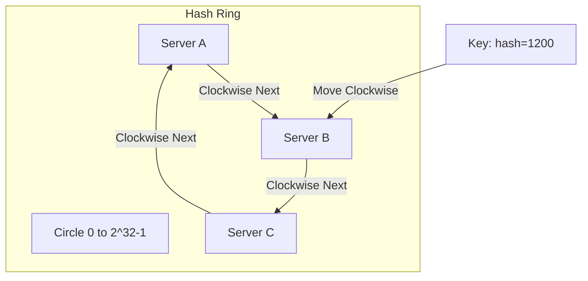

*   **Routing Mechanism:** A key's hash is placed on the ring. Move clockwise until the first server hash is reached; store the key on that server.
*   **Node Addition/Removal:** Only keys located between the modified node and its counter-clockwise neighbor need re-mapping. All other nodes remain untouched.
*   **Virtual Nodes (VNodes):** Maps a physical node to dozens of virtual positions across the ring (e.g., `Server_A_1`, `Server_A_2`). This ensures keys are distributed uniformly, preventing hot-spots on single machines.

---

### Q2: Detail Database Sharding. Explain Range-based, Key-based, and Directory-based sharding. What are the main challenges?

**Answer:**
Sharding splits a large database horizontally, storing different subsets of rows (shards) across distinct database servers.

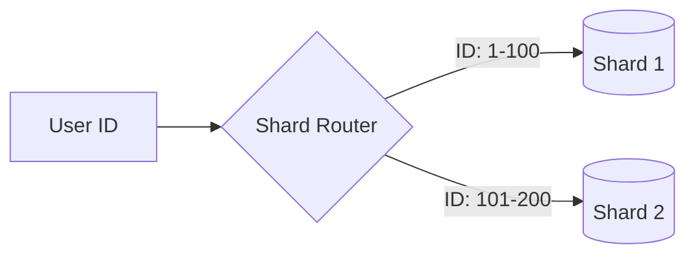

*   **Range-Based Sharding:**
    *   Data is split based on ranges of a key attribute (e.g., IDs $0-10,000$ go to Shard 1, $10,001-20,000$ go to Shard 2).
    *   *Risk:* Severe hotspots (e.g., if new users are highly active and get higher IDs).
*   **Key-Based (Hash-Based) Sharding:**
    *   Uses a hash function on the sharding key to select the shard: `shard_id = hash(key) % total_shards`.
    *   *Risk:* Hard to scale total shards without re-sharding all existing data (mitigated by Consistent Hashing).
*   **Directory-Based Sharding:**
    *   Maintains a lookup table/directory indicating which shard contains what key.
    *   *Risk:* The lookup table itself becomes a single point of failure (SPOF) and query bottleneck.
*   **Main Challenges:**
    *   *Cross-Shard Joins:* Performing `JOIN` queries across multiple servers is incredibly expensive and slow.
    *   *Referential Integrity:* Enforcing foreign keys across shards is practically impossible.
    *   *Re-sharding:* Splitting an existing, overloaded shard during active traffic is extremely complex.

---

### Q3: What is the CAP Theorem? Explain how Consistency, Availability, and Partition Tolerance interact.

**Answer:**
The **CAP Theorem** states that a distributed system can guarantee at most **two** of the following three properties simultaneously in the event of a network partition:

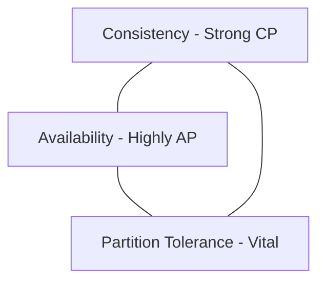

*   **Consistency (C):** Every read receives the most recent write or an error.
*   **Availability (A):** Every non-failing node returns a non-error response (without guaranteeing it contains the most recent write).
*   **Partition Tolerance (P):** The system continues to operate despite arbitrary packet loss or network splits between nodes.
*   **The Trade-off:** Network partitions ($P$) are physical facts. Therefore, during a partition, a system must choose:
    *   **CP (Consistency over Availability):** Reject writes or block reads until network splits heal, guaranteeing data correctness but degrading availability.
    *   **AP (Availability over Consistency):** Accept reads and writes on both split sides, keeping the system fully available but risking split-brain data conflicts.

---

### Q4: Explain Message Queues. Contrast RabbitMQ (AMQP push-model) and Apache Kafka (log-based pull-model).

**Answer:**
A **Message Queue (MQ)** decouples message producers and consumers, buffering request bursts.

*   **RabbitMQ (AMQP Push-Model):**
    *   *Broker Internals:* Messages are pushed to exchanges, routed to queues based on routing keys, and pushed to active consumers.
    *   *Message State:* Tracked by the broker. Once a message is acknowledged, it is deleted from disk.
    *   *Use Case:* Complex routing, transaction flows, and short-lived message processing.
*   **Apache Kafka (Log-Based Pull-Model):**
    *   *Broker Internals:* An append-only commit log. Messages are written sequentially to partitions.
    *   *Message State:* Tracked by consumers via an offset marker. Messages persist on disk after consumption (immutable history).
    *   *Use Case:* High-throughput event streaming, log aggregation, real-time analytics.

---

### Q5: What are the core Rate Limiting Algorithms?

**Answer:**
Throttling engines used to enforce system-wide fair-use limits.

*   **Token Bucket:**
    *   Tokens are added to a bucket at a fixed rate. Requests consume tokens. If empty, requests are dropped.
    *   *Pros:* Natural handling of short traffic bursts.
*   **Leaky Bucket:**
    *   Requests enter a queue. The queue drips (dispatches) requests at a constant, smooth rate.
    *   *Pros:* Smooths out traffic, preventing downstream spikes.
*   **Fixed Window Counter:**
    *   Counts requests within fixed time windows (e.g., 100/min from 12:00 to 12:01).
    *   *Cons:* Allows double the limit at window boundaries (e.g., 100 requests at 11:59:59 and 100 at 12:00:01).
*   **Sliding Window Log:**
    *   Saves exact timestamps of all requests in a sorted set (like Redis ZSET). Evicts timestamps older than (Current Time - Window Size).
    *   *Cons:* Extremely high memory consumption because every single request timestamp must be stored.
*   **Sliding Window Counter:**
    *   Hybrid approach. Computes a weighted sum of request counts from the current and previous windows to estimate instantaneous rate.
    *   *Pros:* Memory efficient; smooths boundary spikes.

---

### Q6: Detail cache-aside, write-through, and write-behind write patterns with their specific failure scenarios.

**Answer:**
*   **Cache-Aside:**
    *   *Flow:* Application writes to DB, then deletes cache key.
    *   *Failure Scenario:* Race condition. Thread A has a cache miss, reads old value from DB. Thread B writes new value to DB, deletes cache. Thread A writes old value back to cache. Cache is now permanently stale. *Mitigation:* Set short TTLs.
*   **Write-Through:**
    *   *Flow:* Application writes to cache; cache immediately writes to DB in the same execution thread.
    *   *Failure Scenario:* DB write fails after cache update. Cache and DB are out of sync. *Mitigation:* Wrap cache and DB updates in a distributed transaction or revert cache.
*   **Write-Behind (Write-Back):**
    *   *Flow:* Application writes to cache; async worker writes to DB in background batches.
    *   *Failure Scenario:* Cache node crashes before background worker flushes data to the DB. Written data is permanently lost. *Mitigation:* Run highly available master-slave cache replicas.

---

### Q7: Explain Database Isolation Levels and the anomalies they prevent.

**Answer:**
Governs how database systems handle concurrent transactions to guarantee state consistency.

*   **Isolation Levels:**
    1.  **Read Uncommitted:** No isolation. Transaction reads uncommitted changes from others.
        *   *Anomalies:* **Dirty Reads** (reading data that is eventually rolled back).
    2.  **Read Committed:** Read operations only see committed data.
        *   *Anomalies:* **Non-Repeatable Reads** (re-reading a row inside Transaction A returns different values because Transaction B committed an update).
    3.  **Repeatable Read:** Guarantees that any row read during Transaction A yields the exact same data until completion.
        *   *Anomalies:* **Phantom Reads** (Transaction A executes a range query; Transaction B inserts a new row matching that range, causing the range query to return unexpected new rows on re-execution).
    4.  **Serializable:** Extreme isolation. Transactions execute sequentially. No anomalies, but extremely slow throughput.

---

### Q8: What is a Bloom Filter? How does it work and where is it used?

**Answer:**
A space-efficient probabilistic data structure used to test whether an element is a member of a set.

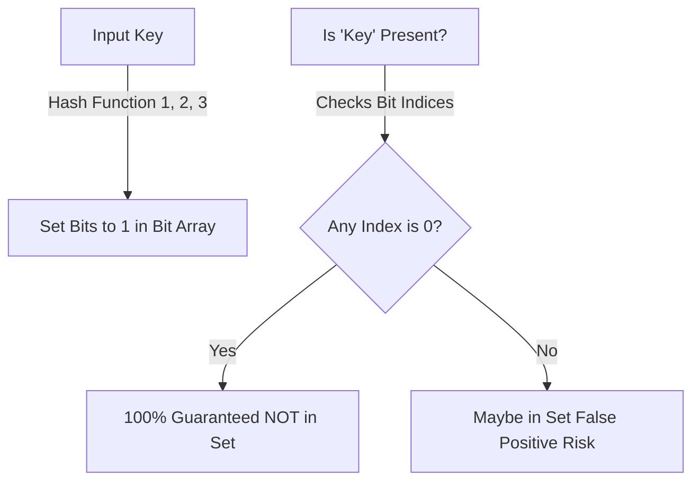

*   **Mechanism:** An array of $m$ bits, initially all set to 0. When an element is inserted, $k$ independent hash functions map it to $k$ array indices, setting those bits to 1.
*   **Queries:** Check the bits at the $k$ hashed indices.
    *   If *any* bit is 0, the element is **guaranteed** not to be in the set.
    *   If all bits are 1, the element **might** be in the set (false positive chance).
*   **Use Cases:** Bypassing expensive disk lookups in Cassandra or HBase for non-existent keys; filtering database query hits before reaching the database cache.

---

### Q9: Contrast Long-Polling, WebSockets, and Server-Sent Events (SSE).

**Answer:**
*   **HTTP Long Polling:**
    *   *Mechanism:* Client sends HTTP request. Server blocks until data is available, then returns response. Connection closes. Client immediately opens another request.
    *   *Pros:* Simple, fallback option.
    *   *Cons:* High CPU/HTTP header overhead on connections.
*   **WebSockets:**
    *   *Mechanism:* Upgrades standard HTTP/1.1 connection to a TCP, full-duplex, bidirectional socket tunnel.
    *   *Pros:* Bidirectional, low header overhead.
    *   *Cons:* Requires sticky-session load balancers, non-trivial scaling.
*   **Server-Sent Events (SSE):**
    *   *Mechanism:* HTTP/2 unidirectional stream where the server pushes updates continuously.
    *   *Pros:* Native browser recovery on disconnect, runs over standard HTTP, simple implementation.
    *   *Cons:* Client cannot push data up the stream (must open separate POST requests).

---

### Q10: What is a WAL (Write-Ahead Log)? Explain its role in crash recovery.

**Answer:**
A **WAL** is an append-only, sequential disk file where all transaction updates are logged *before* being written to the actual database indexes or table spaces.

*   **Role in Crash Recovery:**
    *   Writing randomly to a database index (like a B+Tree on disk) is slow. Logging sequentially to the WAL is extremely fast.
    *   If a database crashes mid-transaction, memory buffers (dirty pages) are wiped out.
    *   Upon restart, the database engine plays back the WAL sequentially to reconstruct the consistent state (**REDO** phase) and rolls back uncommitted transactions (**UNDO** phase).

---

### Q11: Explain Eventual Consistency vs. Strong Consistency.

**Answer:**
*   **Strong Consistency:**
    *   *Guarantee:* Immediately after a write, any subsequent read returns the written value.
    *   *How:* Requires locking replicas, synchronous consensus protocols (Raft, Paxos), or routing all reads and writes to a single master.
    *   *Trade-off:* High latency; vulnerable to network partition drops.
*   **Eventual Consistency:**
    *   *Guarantee:* Replicas will eventually converge to the same value, but reads may briefly return stale data during update windows.
    *   *How:* Replicas synchronize state asynchronously in the background.
    *   *Trade-off:* Lightning-fast writes; system resilient to node failures.

---

### Q12: What is an API Gateway? How does it handle microservice concerns?

**Answer:**
An **API Gateway** is a reverse-proxy entry point sitting in front of a microservices mesh.

*   **Concerns Addressed:**
    *   *Dynamic Routing:* Maps public routes (e.g., `/v1/orders`) to changing internal IPs of microservice instances (integrated with Consul/Eureka).
    *   *Security:* Validates JWT signatures once at the edge, saving backend microservices from duplicate processing.
    *   *Resilience:* Implements global rate limiters, request timeouts, and client-facing error fallbacks.

---

### Q13: Detail how a distributed lock works using Redis (Redlock) or Zookeeper.

**Answer:**
*   **Redis (Redlock):**
    *   Acquire lock by writing a unique string with an expiration TTL: `SET lock_key unique_token NX PX 10000`.
    *   *Redlock Cluster:* Attempt to acquire the lock concurrently across $N$ independent Redis masters. If acquired on a majority ($\ge N/2 + 1$) before the lock times out, the lock is held.
    *   *Risk:* Clock drift across servers or long Garbage Collection (GC) pauses can expire locks while a thread is executing critical sections.
*   **ZooKeeper:**
    *   Create ephemeral-sequential nodes. The client holding the lowest sequence number holds the lock.
    *   Others set a `watch` on the node immediately preceding theirs.
    *   *Benefit:* If the lock holder dies, the ephemeral node is instantly deleted, auto-releasing the lock.

---

### Q14: Explain Database Replication Lag. What causes it and how do you mitigate it?

**Answer:**
Replication Lag is the delta time before a write committed on the Master DB is visible on Read Slaves.

*   **Causes:** High-intensity write bursts on the Master, network transport delays, or single-threaded replica engines unable to keep up with multi-threaded Master writes.
*   **Mitigation:**
    *   *Read-Your-Own-Writes:* Route critical user reads (e.g., profile changes, order status) directly to the Master DB for 5-10 seconds post-write.
    *   *Dynamic Routing:* Check replica lag metrics; route reads away from slaves whose lag exceeds a certain threshold (e.g., $> 1\text{ second}$).

---

### Q15: What are Microservices? Detail Service Discovery.

**Answer:**
An architectural pattern decomposing applications into bounded, isolated services communicating via lightweight RPCs (gRPC, REST).

*   **Service Discovery:**
    *   Microservice instances scale up/down dynamically, assigning arbitrary IPs and ports.
    *   **Registry (Consul/ZooKeeper):** Acting as a central directory, microservices register their IP/port on startup, sending heartbeats.
    *   **Discovery Client:** When Service A needs to call Service B, it fetches Service B's active IPs from the Registry and load-balances the call locally.

---

### Q16: Contrast forward proxies, reverse proxies, and load balancers.

**Answer:**
*   **Forward Proxy:** Acts on behalf of the client, protecting the client's identity from external networks (e.g., Squid).
*   **Reverse Proxy:** Acts on behalf of the server. Receives external client requests and forwards them to backend nodes (e.g., Nginx). It performs compression, SSL termination, and caching.
*   **Load Balancer:** Highly specialized reverse proxy focused purely on distributing traffic across a pool of servers to balance load (e.g., HAProxy, AWS ALB).

---

### Q17: What is Database Connection Pooling? Why do we need it?

**Answer:**
It is a cache of pre-established, open TCP connections to a database server.

*   **Why we need it:** Initializing a database connection is highly resource-intensive (requires TCP handshake, security authentication, memory allocation).
*   **Sizing Impact:**
    *   *Too small:* Threads block waiting for connections, increasing latency.
    *   *Too large:* Exhausts database server CPU and RAM. The optimal size is typically constrained by physical disk IOPS and database thread handling capabilities.

---

### Q18: Explain DNS GSLB (Global Server Load Balancing).

**Answer:**
**GSLB** is a DNS-routing technique used to route clients to different physical datacenters globally.

*   **Mechanism:** When a client resolves `api.app.com`, the GSLB nameserver evaluates:
    *   *Client IP:* Maps client geography to route to the nearest datacenter (Anycast routing).
    *   *Datacenter Health:* Monitors active health metrics of endpoints. If Datacenter USA-East is down, it seamlessly returns the IP of USA-West, preventing cross-continent outages.

---

### Q19: What is a Dead Letter Queue (DLQ)?

**Answer:**
A **DLQ** is a dedicated message queue holding messages that failed processing due to invalid payloads, structural errors, or database exceptions.

*   **Role in HLD:** Prevents "poison pill" messages from blocking active consumer queues. Active consumers isolate unprocessable messages to the DLQ, raising an alert for developer inspection while continuing to process healthy messages.

---

### Q20: Detail the split-brain scenario. How does quorum prevent it?

**Answer:**
A **Split-Brain** occurs when network partitions sever connection between nodes in a cluster, causing separate halves to elect independent Master nodes simultaneously. Both write to storage, permanently corrupting state.

*   **Quorum Prevention:**
    *   No node group can elect a leader unless they contain a strict majority of total cluster nodes: `Quorum Size = (N/2) + 1` (where $N$ is the total cluster size).
    *   Since a network partition can only leave at most one side with a majority, only one partition can elect a leader, keeping the other side read-only or inactive.

---

### Q21: Compare Relational (SQL) and Document (NoSQL) indexing. B-Trees vs. LSM-Trees.

**Answer:**
*   **B-Trees (Relational):**
    *   *Structure:* Organized, balanced multi-way tree structure updated in place.
    *   *Profile:* Blazing-fast reads ($O(\log N)$) but slower random writes due to page splits. Best for read-heavy transactional apps.
*   **LSM-Trees (NoSQL/Write-Optimized):**
    *   *Structure:* Writes append sequentially to an in-memory **MemTable**. MemTable is occasionally flushed to disk as sorted immutable files (**SSTables**). Background threads compact SSTables.
    *   *Profile:* Extremely high-speed, sequential writes. Slower reads due to scanning multiple SSTable levels. Best for write-intensive databases (Cassandra, RocksDB).

---

### Q22: Explain Idempotency. How do you design an idempotent API endpoint?

**Answer:**
An API is **idempotent** if multiple identical requests yield the exact same system state as a single request.

*   **Design for Order/Payment:**
    1.  Client fetches a unique, single-use `idempotency_key` (UUID) from server before submitting payment.
    2.  Client submits payment request with the `idempotency_key` in the header.
    3.  Server tries to insert `idempotency_key` into a Redis instance with a `status: PROCESSING` lock.
        *   If key already exists and is `SUCCESS`, return cached payment response instantly.
        *   If `PROCESSING`, return error block.
    4.  If not exists, proceed with payment transaction. Update lock to `status: SUCCESS` and cache the final response payload.

---

### Q23: What are HTTP Keep-Alive and TCP Keep-Alive?

**Answer:**
*   **HTTP Keep-Alive:** An application-layer mechanism keeping the underlying TCP connection open across multiple sequential HTTP requests, skipping the overhead of recreating TCP connections for every page asset.
*   **TCP Keep-Alive:** A transport-layer heartbeat packet sent silently between network nodes to check if a connection is still alive, enabling routers and firewalls to purge dead or abandoned connections from connection tables.

---

### Q24: Explain blue-green deployment vs. canary deployment.

**Answer:**
*   **Blue-Green Deployment:**
    *   Maintains two identical production environments (Blue - Live, Green - Idle).
    *   New code is deployed to Green. Once verified, router/load-balancer switches traffic instantly from Blue to Green.
    *   *Benefit:* Fast rollbacks (switch router back). High resource overhead.
*   **Canary Deployment:**
    *   Deploys new code to a tiny subset (e.g., 2%) of active servers.
    *   If error rates and latencies are stable, incrementally routes traffic to 10%, 50%, then 100% of nodes.
    *   *Benefit:* Safe. Catches errors before they affect the entire user base.

---

### Q25: What is horizontal scaling of WebSockets? Why is it difficult?

**Answer:**
Scaling WebSockets horizontally is difficult because WebSocket connections are **stateful**; a persistent TCP connection is pinned to a specific application node.

*   **How to handle:**
    *   *Message Routing:* When User A (on Server 1) sends a message to User B (on Server 2), Server 1 cannot deliver it directly.
    *   *Redis Pub/Sub:* Run a Redis Pub/Sub backplane. Every server subscribes to its own server-ID channel. Message is published to a shared Redis cluster, which routes the payload to Server 2 to stream down to User B.

---

### Q26: Detail the database N+1 query problem and its optimization.

**Answer:**
Occurs when an application fetches parent records, then issues individual sequential queries for each parent's children (e.g., fetching 100 posts, then running 100 separate queries to get comments for each post).

*   **Optimization:**
    *   *SQL Joins:* Fetch parent and children together in one single query using a `LEFT JOIN`.
    *   *Query Batching:* Fetch parents first, collect all parent IDs, and issue one batch query: `SELECT * FROM comments WHERE post_id IN (1, 2, 3... 100)`.

---

### Q27: What is CQRS (Command Query Responsibility Segregation)?

**Answer:**
An architectural pattern separating the model used to update database records (Commands/Writes) from the model used to read records (Queries/Reads).

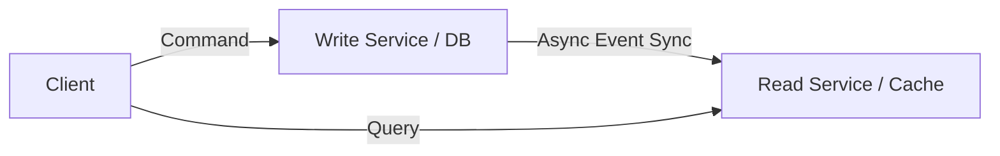

*   **Why use it:** Writes require complex transactional safety, validation, and locking. Reads require ultra-fast index scanning, projections, and aggregation. Segregating models allows scaling and optimizing write and read databases independently (e.g., write to PostgreSQL, read from Elasticsearch).

---

### Q28: Explain what an Outbox Pattern is. Why do we need it?

**Answer:**
When a microservice updates its database *and* publishes an event to a message queue, doing this sequentially risks inconsistency if the network fails midway.

*   **Outbox Solution:**
    1.  The database transaction writes to the business table *and* inserts a row into an `outbox` table in the same atomic transaction.
    2.  An independent background process (Transactional Outbox Worker or Debezium CDC) reads new rows from the `outbox` table and publishes them to the Message Queue.
    3.  Once published successfully, the worker marks the outbox row as processed. Guarantees **At-Least-Once** event delivery.

---

### Q29: Explain Heartbeats vs. Gossip Protocol.

**Answer:**
*   **Heartbeats:** Point-to-point status reporting where nodes ping a central cluster manager (e.g., ZooKeeper).
    *   *Cons:* Central manager is a bottleneck. High network overhead at massive scale.
*   **Gossip Protocol:** A decentralized, peer-to-peer communication model where nodes randomly swap cluster state metadata with a few neighbors.
    *   *Pros:* No single point of failure. Highly scalable. State updates propagate across the entire cluster with $O(\log N)$ steps.

---

### Q30: What is circuit breaking? Explain the states.

**Answer:**
A design pattern used to prevent cascading failures across microservices.

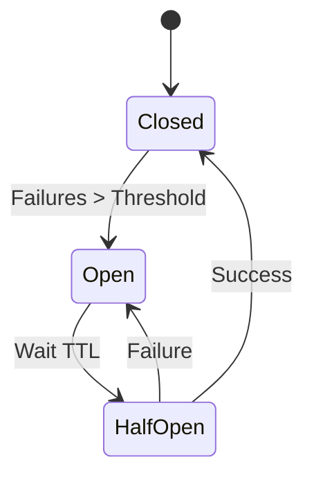

*   **Closed:** Normal operation. Requests flow to downstream services.
*   **Open:** Downstream failures cross threshold (e.g., 50% errors). Requests are immediately rejected at the Gateway with a fallback error response. Bypasses the downstream service entirely to allow it to recover.
*   **Half-Open:** After a cool-down timer, the gateway lets a tiny fraction of requests through. If they succeed, circuit closes (normal operation). If they fail, circuit re-opens.

---

### Q31: Contrast SSD vs. HDD read/write profiles.

**Answer:**
*   **HDD (Hard Disk Drive):**
    *   Depends on spinning physical disks and reading heads.
    *   *Sequential Access:* Extremely fast (heads read data in a continuous stream).
    *   *Random Access:* Incredibly slow (heads must mechanically move/seek different disk regions $\sim 10\text{ ms}$).
*   **SSD (Solid State Drive):**
    *   Uses flash memory arrays. No moving parts.
    *   *Random Access:* Blazing fast ($\sim 0.1\text{ ms}$) compared to HDDs.
    *   *System Design Impact:* Databases like Cassandra prioritize append-only, sequential disk writes (using MemTables/SSTables) to maximize sequential IOPS capacity of HDDs and reduce SSD write wearing.

---

### Q32: What is a reverse proxy cache? How does it cache dynamic content?

**Answer:**
A cache sitting in front of web servers (e.g., Varnish, Nginx). It intercepts HTTP requests and checks its cache. It evaluates HTTP headers like `Cache-Control` (e.g., `s-maxage=600`) and cookies. If the client request does not contain a session cookie, the proxy serves cached HTML, completely bypassing app servers.

---

### Q33: Explain Database Partitioning vs. Sharding.

**Answer:**
*   **Database Partitioning:** Splits large tables into smaller logical parts *within the same physical database instance* (e.g., partitioning a `sales` table by year into `sales_2025` and `sales_2026`).
*   **Sharding:** Distributes different rows across *completely separate physical database servers/instances*. It scales physical computing power, disk IOPS, and RAM capacity.

---

### Q34: What is a distributed session store?

**Answer:**
An external high-availability database (usually Redis or DynamoDB) holding client session data. App servers are completely stateless; they receive a session ID from the client's cookie, query Redis for active session details, process requests, and save state back to Redis, enabling seamless horizontal scale-out.

---

### Q35: How does the SSL/TLS handshake work at a high level?

**Answer:**
1.  **Client Hello:** Client sends supported cipher suites and random bytes.
2.  **Server Hello:** Server returns selected cipher, random bytes, and its SSL/TLS Certificate.
3.  **Authentication:** Client verifies server certificate against trusted Root Certificate Authorities.
4.  **Key Exchange:** Client sends pre-master secret key encrypted with server's public key (or uses Diffie-Hellman for Perfect Forward Secrecy).
5.  **Session Key Generation:** Both parties compute symmetric session keys from secrets.
6.  **Encrypted Session:** Subsequent data is encrypted using high-performance symmetric keys.

---

### Q36: What is backpressure in high-throughput systems?

**Answer:**
**Backpressure** occurs when a fast producer generates data faster than a slow consumer can process it, causing buffer exhaustion.
*   *Mitigation:* The consumer explicitly signals the producer to slow down or pause, or the queue drops excess messages (e.g., tail drop policies) to protect system memory.

---

### Q37: Explain the Saga Pattern. Contrast Orchestration and Choreography.

**Answer:**
Manages distributed transactions across multiple microservices without locking resources.

*   **Choreography-based Saga:**
    *   *Mechanism:* Decentralized. Each microservice completes its local transaction and publishes an event. Other services listen and execute their tasks.
    *   *Rollback:* If a step fails, compensation events are published backward to undo preceding writes.
*   **Orchestration-based Saga:**
    *   *Mechanism:* Centralized. A dedicated **Saga Orchestrator** microservice coordinates all transactions, explicitly sending commands to each service and tracking state. It executes compensating transactions if any step fails.

---

### Q38: What is Database Read/Write Splitting?

**Answer:**
An architectural pattern where all database modifications (write transactions) are routed to a Primary Master DB, while all read queries are routed to one or more Replica Slaves. This separates write locks and computational indexing loads, accelerating read throughput at scale.

---

### Q39: What is a materialized view? When should you use it?

**Answer:**
A database view that physically stores the results of a complex query on disk.
*   *Use Case:* Generating high-frequency dashboards or aggregations (e.g., total sales per category).
*   *Update Strategies:* Recalculate periodically (e.g., every hour) or update incrementally using database triggers or Change Data Capture (CDC) events.

---

### Q40: Explain data compression in high-throughput networks (Protobuf vs. JSON).

**Answer:**
*   **JSON:** Plaintext format. Contains repetitive key names in every object. Heavy network payload; slow serialization/deserialization CPU cycles.
*   **Protocol Buffers (Protobuf):** Binary format. Omits keys, using tag numbers mapping to a pre-defined schema compiled into app code. Payloads are up to 80% smaller and serialize up to 10x faster, maximizing network bandwidth.

---

### Q41: What is an anycast IP and how does it route traffic?

**Answer:**
In **Anycast IP** routing, multiple physical servers in different locations share the exact same IP address. Routers across the internet use BGP (Border Gateway Protocol) to send packets to the physically closest active server announcement point, routing users automatically to local CDN/DNS edge datacenters.

---

### Q42: Explain the significance of P95, P99, and P99.9 latency metrics over average.

**Answer:**
Average (mean) latency hides bad performance of outliers (e.g., if 99 users wait 10ms and 1 user waits 10s, average is a decent $\approx 110\text{ ms}$).
*   **Percentiles:**
    *   *P95:* 95% of requests are faster than this threshold.
    *   *P99:* 99% of requests are faster than this.
    *   *P99.9:* 1 out of 1000 requests experiences a slow response. Crucial for high-scale systems where "1 out of 1000" represents millions of frustrated daily users.

---

### Q43: What is a distributed trace and why do we need correlation IDs?

**Answer:**
A **Distributed Trace** follows a request's journey across various microservices and databases.
*   **Correlation ID:** A unique UUID generated at the API Gateway and injected into the HTTP header of the incoming request. Every downstream microservice must forward this exact correlation ID in its internal logs and downstream API/database calls, enabling tracing systems (e.g., Jaeger) to stitch together logs and visualize latency bottlenecks.

---

## Architecture & Design Challenges

### Q44: Design a Distributed Rate Limiter

**Answer:**
A distributed engine capable of enforcing API limits across millions of users on a multi-node cluster.

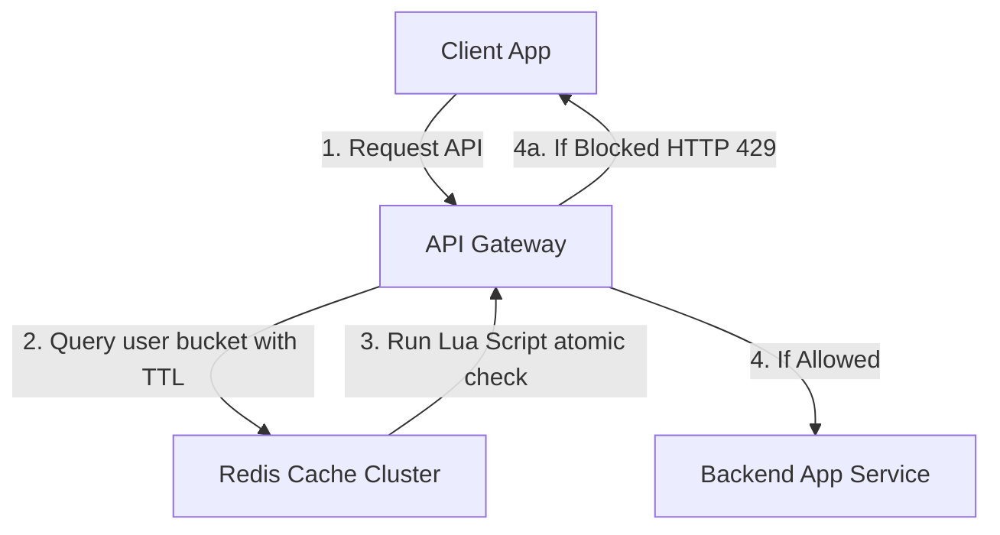

#### 1. API Design:
*   Header: `X-RateLimit-Limit: 100`, `X-RateLimit-Remaining: 99`, `X-RateLimit-Reset: 1724694000`

#### 2. Key Technology Choices:
*   **Redis Cluster:** In-memory, ultra-fast reads/writes ($< 1\text{ ms}$).
*   **Lua Scripting:** Solves race conditions. Executed atomically inside a single Redis thread.
    ```lua
    local key = KEYS[1]
    local limit = tonumber(ARGV[1])
    local current = tonumber(redis.call('get', key) or "0")
    if current + 1 > limit then
        return 0
    else
        redis.call("INCRBY", key, 1)
        if current == 0 then
            redis.call("EXPIRE", key, 60)
        end
        return 1
    end
    ```

---

### Q45: Design a Distributed Web Crawler

**Answer:**
A scalable crawler that downloads and parses the web, handling politeness and URL duplication.

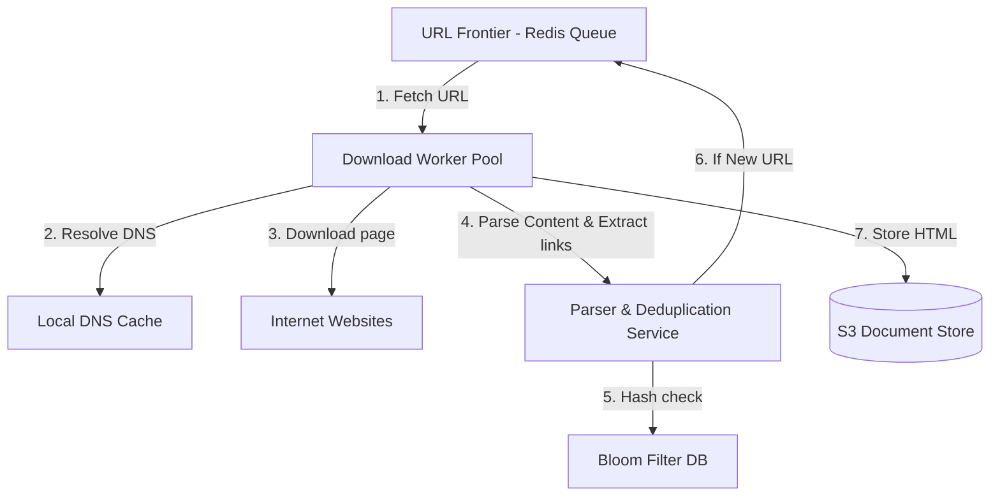

#### 1. Core Mechanics:
*   **URL Frontier:** FIFO Priority queues organized by domain to ensure politeness (delaying consecutive requests to the same IP).
*   **Deduplication:** Hash check utilizing a cluster of distributed **Bloom Filters** to check if a URL has already been visited before queueing.

---

### Q46: Design a Scalable News Feed System (like Twitter/Facebook)

**Answer:**
A real-time news feed aggregator serving posts to millions of users.

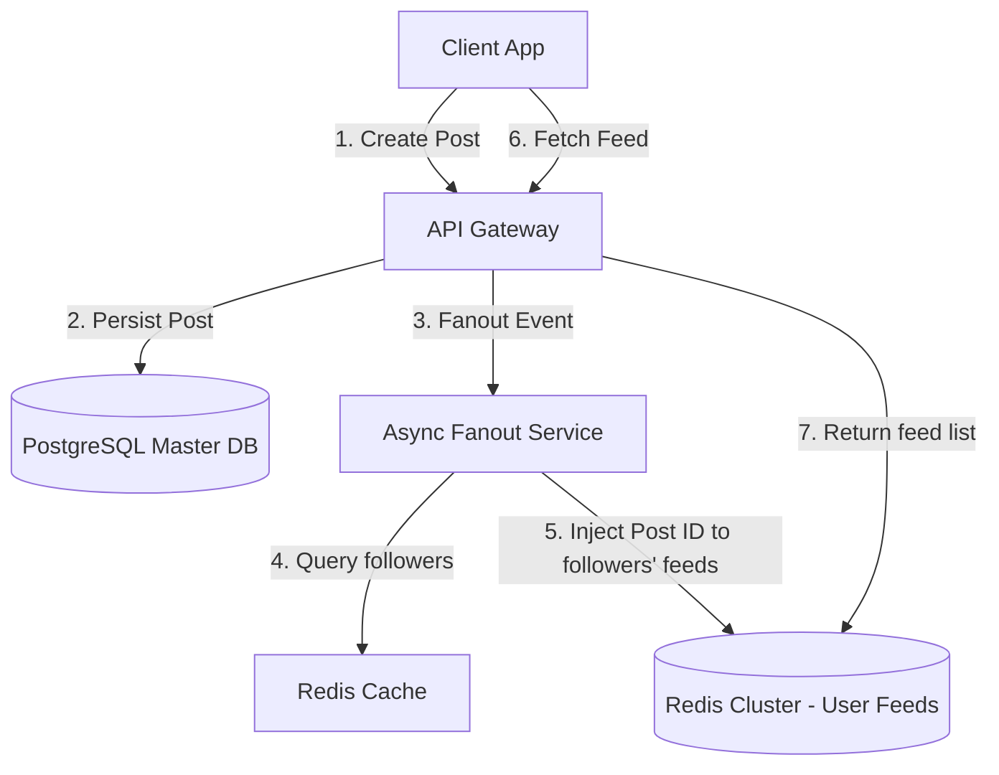

#### 1. Ingestion & Fanout Strategies:
*   **Pull Model (Active):** Client occasionally polls database. *Best for heavy users with millions of followers (celebrities)*.
*   **Push Model (Fanout-on-Write):** When a user posts, the fanout worker queries their followers and inserts the post ID directly into each follower's active **Redis Feed Cache**.
*   **Hybrid Model:** Push for standard users, pull/merge on-demand for celebrity accounts.

---

### Q47: Design a Scalable Chat Application (like WhatsApp or Slack)

**Answer:**
A real-time messaging pipeline handling connection routing, message persistence, and delivery.

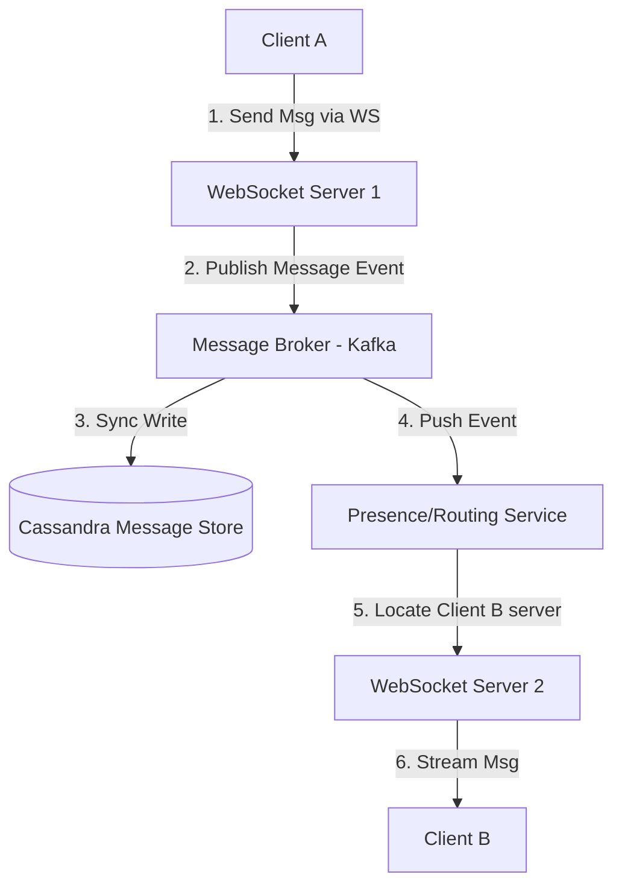

#### 1. Key Characteristics:
*   **WebSocket Gateway:** Fleet of servers holding persistent connections.
*   **Storage (Cassandra):** Wide-column database schema mapping messages sequentially:
    *   *Partition Key:* `chat_id` (UUID).
    *   *Clustering Key:* `timestamp` (DESC). This guarantees ultra-fast range reads for loading chat history.

---

### Q48: Design a Scalable E-commerce Cart & Checkout System

**Answer:**
A high-integrity transactional system ensuring accurate cart checkout, stock availability, and payment processing under extreme flash sales.

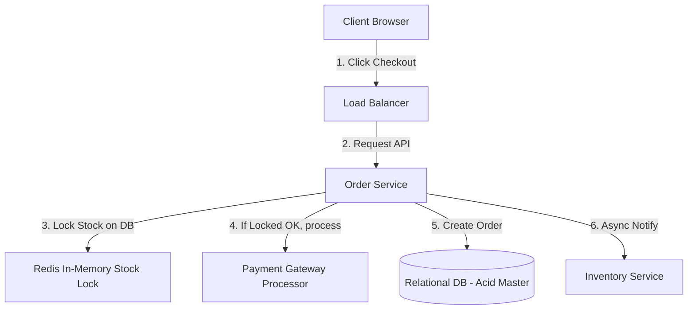

#### 1. DB Schema (`orders` table):
*   `order_id` (UUID - PK), `user_id` (UUID), `status` (VARCHAR), `total_amount` (DECIMAL).

#### 2. Stock Reservation (Redis Mutex):
*   Avoid DB lock bottleneck. Keep active stock count in Redis. Use a Lua script to reserve stock atomically:
    `if redis.call("get", item_id) > 0 then redis.call("decr", item_id); return 1 else return 0 end`. If payment fails, release the stock reservation.

---

### Q49: Design a Distributed Key-Value Store (like Cassandra or Dynamo)

**Answer:**
A highly reliable, peer-to-peer, write-intensive key-value database.

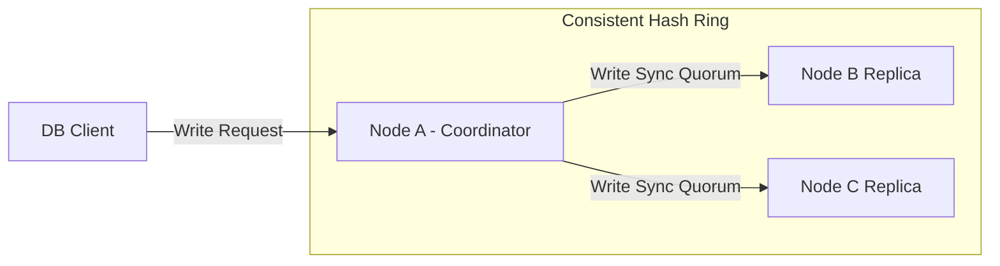

#### 1. Design Characteristics:
*   **SSTables + WAL:** Ingestion writes to RAM MemTable and logs sequentially to WAL on disk before acknowledging.
*   **Quorum Configurator ($R + W > N$):**
    *   $N$: Replication Factor (typically 3).
    *   $W$: Write Quorum (e.g., 2 nodes must ACK write).
    *   $R$: Read Quorum (e.g., 2 nodes must ACK read with identical version).
    *   Since $2 + 2 > 3$, reads are guaranteed to fetch the latest write.

---

### Q50: Design an API Gateway & Rate Limiter Architecture

**Answer:**
An integrated edge layer handling authentication, global limit validation, and service mesh routing.

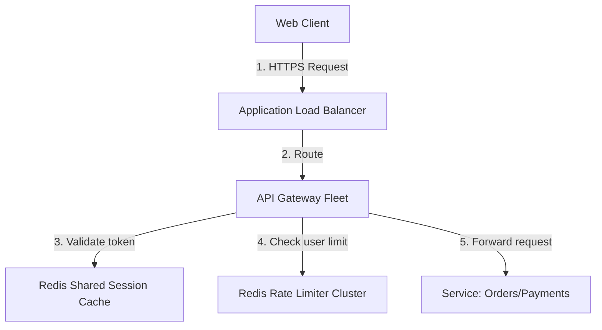

#### 1. Key Operations Flow:
*   API Gateway interceptor executes in 3 steps:
    1.  **Auth Interceptor:** Checks Authorization header, verifies JWT validity via public key.
    2.  **Rate Limit Interceptor:** Queries the Redis Rate Limiter cluster.
    3.  **Reverse-Proxy Interceptor:** Queries Consul for active service IPs, load-balances and forwards the request via HTTP/2 or gRPC.
